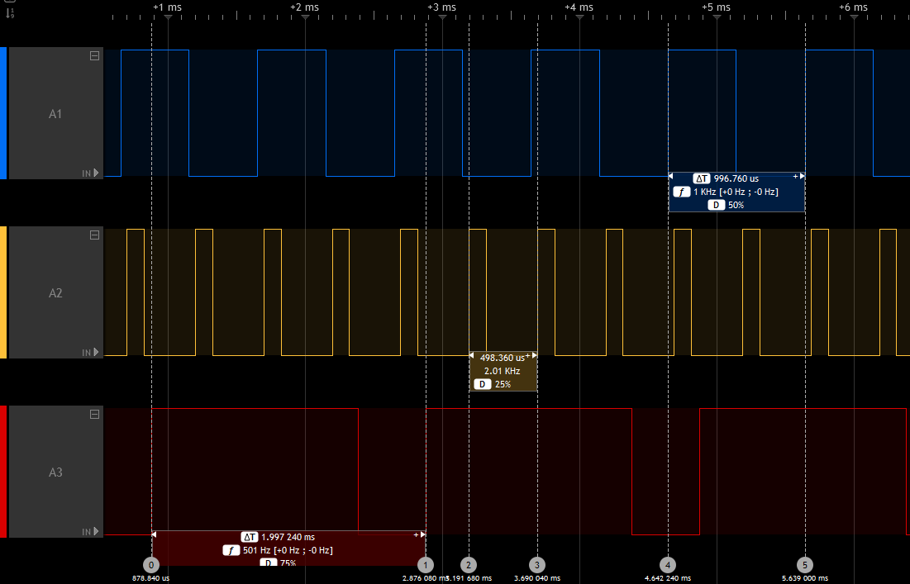

# API

 * [Core](#core)
   * [Core version](#core-version)
   * [Core Callback](#core-callback)
 * [Wiring](#wiring)
   * [Analog](#analog)
   * [HardwareSerial](#hardwareserial)
   * [HardwareTimer library](HardwareTimer-library.md)
 * [Built-In Library](#built-in-library)
   * [SPI](#spi)
   * [I2C](#i2c)
   * [CMSIS DSP](#cmsis-dsp)
   * [EEPROM emulation](#eeprom-emulation)
   * [Servo library](libraries/built-in/Servo-library.md)
 * [Other](#other)
   * [Remembering variables across resets](#remembering-variables-across-resets)

# Core

This part describes the STM32 core functions.

## Core version
This was introduced core version greater than **1.5.0**.
It is based on Semantic Versioning 2.0.0 (https://semver.org/).

This ease core dependencies and defined [here](https://github.com/stm32duino/Arduino_Core_STM32/blob/d7c6b8b39b5dad3e5aa929cfa6ff235197aeea36/cores/arduino/stm32/stm32_def.h#L5-L21).

`STM32_CORE_VERSION` defines the core version with:
 * `STM32_CORE_VERSION_MAJOR`: major version [31:24]
 * `STM32_CORE_VERSION_MINOR`: minor version [23:16]
 * `STM32_CORE_VERSION_PATCH`: patch version [15:8]
 * `STM32_CORE_VERSION_EXTRA`: Extra label [7:0]
   with:
   * `0`: official release
   * `[1-9]`: release candidate
   * `F[0-9]`: development

### Example

```C
#if !defined(STM32_CORE_VERSION) || (STM32_CORE_VERSION  <= 0x01050000)
/* Do something for core version lesser than or equal to 1.5.0 */
#else
/* Do something for core version greater than 1.5.0 */
#endif
```

## Core Callback

CoreCallback functions allows to register a callback function called in the loop of the `main()` function. 
If you need to call as often as possible a function to update your system and you want to be sure this function to be called, you can add it to the callback list. Otherwise, your function should be called inside the `loop()` function of
the sketch.

* `void registerCoreCallback(void (*func)(void))`: register a callback function  
_Params_ `func` pointer to the callback function  

* `void unregisterCoreCallback(void (*func)(void))`: unregister a callback function  
_Params_ `func` pointer to the callback function  

> [!WARNING]
> By default, the core callback feature is disabled, to enable it `CORE_CALLBACK` must be defined.

[`build_opt.h`][build_opt.h] can be used to define it by adding `-DCORE_CALLBACK`.

# Wiring

## Analog

### analogWrite: DAC, PWM or GPIO

`analogWrite()` function follows the [API reference](https://www.arduino.cc/reference/en/language/functions/analog-io/analogwrite/).
As each pin has not the same capabilities, it uses the best way:
1. True analog output when using on pins with DAC capabilities anf if `HAL_DAC_MODULE_ENABLED` is defined
2. PWM on pins with timer (TIM) capabilities.
3. GPIO toggling HIGH/LOW depending on requested value: `HIGH` if > 127 else `LOW`

### Frequency
`analogWriteFrequency(freq)` has been added in core version greater than **1.5.0** to set the frequency used by `analogWrite()`. Default is `PWM_FREQUENCY` (1000) in Hertz.

> [!NOTE]
> frequency is common to all channels of a specified timer, setting the frequency for one channel will impact all others of the same timer.

#### Example
```C
  // Assuming Ax pins have PWM capabilities and use a different Timer.
  analogWrite(A1, 127); // Start PWM on A1, at 1000 Hz with 50% duty cycle
  analogWriteFrequency(2000); // Set PWM period to 2000 Hz instead of 1000
  analogWrite(A2, 64); // Start PWM on A2, at 2000 Hz with 25% duty cycle
  analogWriteFrequency(500); // Set PWM period to 500 Hz
  analogWrite(A3, 192); // Start PWM on A3, at 500 Hz with 75% duty cycle
```



### DAC output buffer

> [!NOTE]
> Available since version 2.8.0, thanks [#2309](https://github.com/stm32duino/Arduino_Core_STM32/pull/2309).

It is now possible to disable the DAC output buffer (which is enabled by default) by defining `DISABLE_DAC_OUTPUTBUFFER`
using one of the below options:
 * [hal_conf_extra.h](customization/HAL-configuration.md)
 * [`build_opt.h`][build_opt.h]
 * header file of the variant: `variant_<boardname>.h`

### ADC general
 * setup: `pinMode(pin, INPUT_ANALOG);` 
   has to be an ADC pin (e.g. PA0)
 * read: `uint16_t adc_value = analogRead(pin);`

### ADC internal channels
Available in core version greater than **1.5.0**

`analogRead()` can now be used to read some  internal channels with the following definitions:
 * `ATEMP`: internal temperature sensor
 * `AVREF`: VrefInt, internal voltage reference
 * `AVBAT`: Vbat voltage

### ADC read resolution (bits)

Currently, `analogRead(pin)` returns a 10 bit resolution, to mimic an 'uno' behavior, this is in case some libraries expects
10 bits.

This can be updated using `analogReadResolution(int bits)`, e.g. `analogReadResolution(12)` to get a native resolution say 12 bits from the stm32 ADC

### ADC sampling time

A minimum ADC sampling time is required when reading internal channels so default is set it to max possible value. It can be defined more precisely by defining:
 * `ADC_SAMPLINGTIME_INTERNAL`
to the desired ADC sample time.

`ADC_SAMPLINGTIME` and `ADC_CLOCK_DIV` could also be redefined by the variant or using [`build_opt.h`][build_opt.h].

#### Example
An example which read then convert to proper Unit the 3 internal channels + A0 is provided with [STM32Examples](https://github.com/stm32duino/STM32Examples) library:
[Internal_channels](https://github.com/stm32duino/STM32Examples/blob/main/examples/Peripherals/ADC/Internal_channels/Internal_channels.ino)

> [!WARNING]
> This example is provided "as it" and can require some update mainly for datasheet values.

## HardwareSerial

The STM32 MCU's have several _U(S)ART_ peripherals. By convenience, the _U(S)ART_**x** number is used to define the `Serialx`instance:
- `Serial1` for `USART1`
- `Serial2` for `USART2`
- `Serial3` for `USART3`
- `Serial4` for `UART4`
- ... 
For `LPUART1` this is `SerialLP1`

**By default, only one `Serialx` instance is available mapped to the generic `Serial` name.**

To use a second serial port, a `HardwareSerial` object should be declared in the sketch before the `setup()` function:
```C++
//                      RX    TX
HardwareSerial Serial1(PA10, PA9);

void setup() {
  Serial1.begin(115200); 
}

void loop() {
  Serial1.println("Hello World!");
  delay(1000);
}
```
Another solution is to add a [`build_opt.h`][build_opt.h] file alongside your main `.ino` file with: `-DENABLE_HWSERIALx`.
This will define the `Serialx` instance using the first `USARTx` instance found in the `PeripheralPins.c` of your variant.

> [!NOTE]
> that only the latter solution allows to use the `serialEventx()` callback in the sketch.

For Example, if you define in the [`build_opt.h`][build_opt.h]: `-DENABLE_HWSERIAL3`

This will instantiate `Serial3` with the first Rx and Tx pins found in the `PinMap_UART_RX[]` and `PinMap_UART_TX[]` arrays in the `PeripheralPins.c` of your variant and the `serialEvent3()` will be enabled.

To specify which Rx or Tx pins should be used instead of the first one found, you can specified the `PIN_SERIALn_RX` or `PIN_SERIALn_TX` where **n** is the number of the Serial instance.

Example for the `Serial3`:
 - In the `variant.h`:
```c
#define PIN_SERIAL3_RX PB11
#define PIN_SERIAL3_TX PB10
```
 - In the [`build_opt.h`][build_opt.h]:
`-DPIN_SERIAL3_RX=PB11 -DPIN_SERIAL3_TX=PB10`

### New API functions

#### Change default `Serial` instance pins 
It is also possible to change the default pins used by the `Serial` instance using above API:

* `void setRx(uint32_t rx)`
* `void setTx(uint32_t tx)`
* `void setRx(PinName rx)`
* `void setTx(PinName tx)`

> [!WARNING]
> Have to be called before `begin()`.

##### Example:
```C++
    Serial.setRx(PG_9); // using pin name PY_n
    Serial.setTx(PG14); // using pin number PYn
    Serial.begin(9600);
```

#### Enable half-duplex mode

Available in core version greater than **1.7.0**

It is now possible to set a `HardwareSerial` in half-duplex mode.

The `U(S)ART` can be configured to follow a single-wire half-duplex protocol where the Tx and Rx lines are internally connected. In this communication mode, only the Tx pin is used for both transmission and reception.

* Extended `HardwareSerial` constructors: 
  * `HardwareSerial(uint32_t _rxtx)`: U(S)ART Tx pin number (`PYn`) used for half-duplex
  * `HardwareSerial(PinName _rxtx)`: U(S)ART Tx pin name (`PY_n`) used for half-duplex
  * if `Rx == Tx` then assume half-duplex mode:
    * `HardwareSerial(uint32_t _rx, uint32_t _tx)`: U(S)ART Tx pin number (`PYn`) used for half-duplex
    * `HardwareSerial(PinName _rx, PinName tx)`: U(S)ART Tx pin name (`PY_n`) used for half-duplex
  * `HardwareSerial(void *peripheral, HalfDuplexMode_t halfDuplex = HALF_DUPLEX_DISABLED)`: if `HALF_DUPLEX_ENABLED` get the first Tx pin for requested peripheral in the` PeripheralPins.c` used for half-duplex

* Add `enableHalfDuplexRx()` to enable Serial in Rx mode. Doing a `read()` could be used but will avoid to perform a read. Useful before `available()` usage
* `void setHalfDuplex()`: enable half-duplex mode of an instance when it not instantiate in half-duplex mode. Must be call before `begin()` in this case.

##### Example for a **Nucleo L496ZG-P**:
`Serial4` sends byte to `Serial3`, compare values then `Serial3` resend it to `Serial4` and compare.
Require to connect `PA0` and` PB10`.

_All possible constructor are listed._

```C++
HardwareSerial Serial3(PA0);
HardwareSerial Serial4(PB10);

//HardwareSerial Serial3(PA_0);
//HardwareSerial Serial4(PB_10);

//HardwareSerial Serial3(UART4, HALF_DUPLEX_ENABLED);
//HardwareSerial Serial4(USART3, HALF_DUPLEX_ENABLED);

//HardwareSerial Serial3(PA0, PA0);
//HardwareSerial Serial4(PB10, PB10);

//HardwareSerial Serial3(PA_0, PA_0);
//HardwareSerial Serial4(PB_10, PB_10);

//HardwareSerial Serial3(NC, PA_0);
//HardwareSerial Serial4(NC, PB_10);

//HardwareSerial Serial3(NUM_DIGITAL_PINS, PA0);
//HardwareSerial Serial4(NUM_DIGITAL_PINS, PB10);

static uint32_t nbTestOK = 0;
static uint32_t nbTestKO = 0;
void test_uart(int val)
{
  int recval = -1;
  uint32_t error = 0;

  Serial4.write(val);
  delay(10);
  while (Serial3.available()) {
    recval = Serial3.read();
  }
  /* Enable Serial4 to RX*/
  Serial4.enableHalfDuplexRx();
  if (val == recval) {
    Serial3.write(val);
    delay(10);

    while (Serial4.available()) {
      recval = Serial4.read();
    }
    /* Enable Serial3 to RX*/
    Serial3.enableHalfDuplexRx();
    if (val == recval) {
      nbTestOK++;
      Serial.print("Exchange: 0x");
      Serial.println(recval, HEX);
    } else {
      error = 2;
    }
  }
  else {
    error = 1;
  }
  if (error) {
    Serial.print("Send: 0x");
    Serial.print(val, HEX);
    Serial.print("\tReceived: 0x");
    Serial.print(recval, HEX);
    Serial.print(" --> KO <--");
    Serial.println(error);
    nbTestKO++;
  }
}

void setup() {
  Serial.begin(115200);
  Serial4.begin(9600);
  Serial3.begin(9600);
}

void loop() {

  for (uint32_t i = 0; i <= (0xFF); i++) {
    test_uart(i);
  }

  Serial.println("Serial Half-Duplex test done.\nResults:");
  Serial.print("OK: ");
  Serial.println(nbTestOK);
  Serial.print("KO: ");
  Serial.println(nbTestKO);
  while (1);
}
```

> [!NOTE]
> Serial Rx/TX buffer size can be changed, see [Custom-definitions#serial-rxtx-buffer-size](customization/Custom-definitions.md)

#### Enable hardware flow control

Available in core version **2.3.0** or later

* `HardwareSerial` constructors accept optional RTS/CTS pins:
  * `HardwareSerial(uint32_t _rx, uint32_t _tx, uint32_t _rts = NUM_DIGITAL_PINS, uint32_t _cts = NUM_DIGITAL_PINS)`
  * `HardwareSerial(PinName _rx, PinName _tx, PinName _rts = NC, PinName _cts = NC)`
* You can also enable RTS/CTS pins on `HardwareSerial` instances:
  * `void setRts(uint32_t _rts)`
  * `void setCts(uint32_t _cts)`
  * `void setRtsCts(uint32_t _rts, uint32_t _cts)`
  * `void setRts(PinName _rts)`
  * `void setCts(PinName _cts)`
  * `void setRtsCts(PinName _rts, PinName _cts)`

##### Example:

```C++
// Enable hardware flow control on construction.
HardwareSerial serial(PA10, PA9, PA12, PA11);

// Or, enable later (but before calling begin()).
HardwareSerial serial(PA10, PA9);
serial.setRtsCts(PA12, PA11);
serial.begin(460800);
```

#### Enable Tx, Rx Pin Active Level and/or Data Inversion

Available in core version greater than **2.10.1**

The U(S)ART Tx and Rx pin signal values can be inverted (VDD = 0/mark, Gnd = 1/idle), and the U(S)ART can send and receive data in negative/inverse logic (1 = L, 0 = H); the
parity bit is also inverted.

* Enable Tx and Rx active level inversion on `HardwareSerial` instances, respectively:
  * `void setTxInvert(void)`
  * `void setRxInvert(void)`
* Enable data inversion on `HardwareSerial` instances:
  * `void setDataInvert(void)`

## [HardwareTimer library](HardwareTimer-library.md)


# Built-In Library

This part describes the STM32 libraries provided with the core.

## SPI

STM32 SPI library has been modified with the possibility to manage hardware CS pin linked to the SPI peripheral.
_We do not describe here the [SPI Arduino API](https://docs.arduino.cc/language-reference/en/functions/communication/SPI/) but the functionalities added._

User have 2 possibilities about the management of the CS pin:  
* the CS pin is managed directly by the user code before to transfer the data (like the Arduino SPI library)  
* the user uses a hardware CS pin linked to the SPI peripheral  

### New SPISetting parameter

* `noReceive`: value can be `SPI_TRANSMITRECEIVE` or `SPI_TRANSMITONLY`. It allows to skip receive data after transmitting.

### New API functions

* `SPIClass::SPIClass(uint8_t mosi, uint8_t miso, uint8_t sclk, uint8_t ssel)`: alternative class constructor  
_Params_ SPI `mosi` pin  
_Params_ SPI `miso` pin  
_Params_ SPI `sclk` pin  
_Params_ (optional) SPI `ssel` pin. This pin must be an hardware CS pin. If you configure this pin, the chip select will be managed by the SPI peripheral.

##### Example

This is an example of the use of the hardware CS pin linked to the SPI peripheral:

```C++
#include <SPI.h>
//            MOSI  MISO  SCLK   SSEL
SPIClass SPI_3(PC12, PC11, PC10, PC9);

void setup() {
  SPI_3.begin(); // Enable the SPI_3 instance with default SPISsettings
  SPI_3.beginTransaction(settings); // Configure the SPI_3 instance with other settings
  SPI_3.transfer(0x52); // Transfers data to the first device
  SPI_3.end() //SPI_3 instance is disabled
}
```

#### Change default `SPI` instance pins 
It is also possible to change the default pins used by the `SPI` instance using above API:

> [!WARNING]
> Have to be called before `begin()`.

* `void setMISO(uint32_t miso)`
* `void setMOSI(uint32_t mosi)`
* `void setSCLK(uint32_t sclk)`
* `void setSSEL(uint32_t ssel)`
* `void setMISO(PinName miso)`
* `void setMOSI(PinName mosi)`
* `void setSCLK(PinName sclk)`
* `void setSSEL(PinName ssel)`

> [!NOTE]
> Using `setSSEL()` allows to enable hardware CS pin management linked to the SPI peripheral.

##### Example:
```C++
    SPI.setMISO(PC_4); // using pin name PY_n
    SPI.setMOSI(PC2); // using pin number PYn
    SPI.begin(2);
```

## I2C

By default, only one `Wire` instance is available and it uses the Arduino pins D14(SDA) and D15(SCL).
To use a second I2C port, a `TwoWire` object should be declared in the sketch before the `setup()` function:
```C++
#include <Wire.h>
//            SDA  SCL
TwoWire Wire2(PB3, PB10);

void setup() {
  Wire2.begin(); 
}

void loop() {
  Wire2.beginTransmission(0x71);
  Wire2.write('v');
  Wire2.endTransmission();
  delay(1000);
}
```

Refers to [I2C Timing](customization/Custom-definitions.md#i2c-timing) to customize I2C speed if needed.

### Default I2C pins
**The default I2C interface pins are configured inside the PeripheralPins.c file.**

#### Example (for Nucleo-L452RE in file PeripheralPins.c):
```C++
#ifdef HAL_I2C_MODULE_ENABLED 
 WEAK const PinMap PinMap_I2C_SDA[] = { 
   {PA_10, I2C1, STM_PIN_DATA(STM_MODE_AF_OD, GPIO_NOPULL, GPIO_AF4_I2C1)}, 
   {PB_4,  I2C3, STM_PIN_DATA(STM_MODE_AF_OD, GPIO_NOPULL, GPIO_AF4_I2C3)}, 
   {PB_7,  I2C1, STM_PIN_DATA(STM_MODE_AF_OD, GPIO_NOPULL, GPIO_AF4_I2C1)}, 
   //  {PB_7,  I2C4, STM_PIN_DATA(STM_MODE_AF_OD, GPIO_NOPULL, GPIO_AF5_I2C4)}, 
   {PB_9,  I2C1, STM_PIN_DATA(STM_MODE_AF_OD, GPIO_NOPULL, GPIO_AF4_I2C1)}, 
   {PB_11, I2C2, STM_PIN_DATA(STM_MODE_AF_OD, GPIO_NOPULL, GPIO_AF4_I2C2)}, 
   //  {PB_11, I2C4, STM_PIN_DATA(STM_MODE_AF_OD, GPIO_NOPULL, GPIO_AF3_I2C4)}, 
   {PB_14, I2C2, STM_PIN_DATA(STM_MODE_AF_OD, GPIO_NOPULL, GPIO_AF4_I2C2)}, 
   //  {PC_1,  I2C3, STM_PIN_DATA(STM_MODE_AF_OD, GPIO_NOPULL, GPIO_AF4_I2C3)}, 
   {PC_1,  I2C4, STM_PIN_DATA(STM_MODE_AF_OD, GPIO_NOPULL, GPIO_AF2_I2C4)}, 
   {NC,    NP,    0} 
 }; 
 #endif 
  
 #ifdef HAL_I2C_MODULE_ENABLED 
 WEAK const PinMap PinMap_I2C_SCL[] = { 
   {PA_7,  I2C3, STM_PIN_DATA(STM_MODE_AF_OD, GPIO_NOPULL, GPIO_AF4_I2C3)}, 
   {PA_9,  I2C1, STM_PIN_DATA(STM_MODE_AF_OD, GPIO_NOPULL, GPIO_AF4_I2C1)}, 
   //  {PB_6,  I2C1, STM_PIN_DATA(STM_MODE_AF_OD, GPIO_NOPULL, GPIO_AF4_I2C1)}, 
   {PB_6,  I2C4, STM_PIN_DATA(STM_MODE_AF_OD, GPIO_NOPULL, GPIO_AF5_I2C4)}, 
   {PB_8,  I2C1, STM_PIN_DATA(STM_MODE_AF_OD, GPIO_NOPULL, GPIO_AF4_I2C1)}, 
   {PB_10, I2C2, STM_PIN_DATA(STM_MODE_AF_OD, GPIO_NOPULL, GPIO_AF4_I2C2)}, 
   //  {PB_10, I2C4, STM_PIN_DATA(STM_MODE_AF_OD, GPIO_NOPULL, GPIO_AF3_I2C4)}, 
   {PB_13, I2C2, STM_PIN_DATA(STM_MODE_AF_OD, GPIO_NOPULL, GPIO_AF4_I2C2)}, 
   //  {PC_0,  I2C3, STM_PIN_DATA(STM_MODE_AF_OD, GPIO_NOPULL, GPIO_AF4_I2C3)}, 
   {PC_0,  I2C4, STM_PIN_DATA(STM_MODE_AF_OD, GPIO_NOPULL, GPIO_AF2_I2C4)}, 
   {NC,    NP,    0} 
 }; 
 #endif
```

### Redefine I2C pins
Because they are defined as WEAK, you can redefine them in your sketch file instead of changing values in the PeripheralPins.c file. 
You can also enable/disable the internal pull-ups with the second parameter of STM_PIN_DATA().
##### Example (inside of sketch file):
```C++
const PinMap PinMap_I2C_SDA[] = {
  {PB_9,  I2C1, STM_PIN_DATA(STM_MODE_AF_OD, GPIO_NOPULLUP, GPIO_AF4_I2C1)},
  {PC_1,  I2C4, STM_PIN_DATA(STM_MODE_AF_OD, GPIO_PULLUP, GPIO_AF2_I2C4)},
  {NC,    NP,    0}
};
const PinMap PinMap_I2C_SCL[] = {
  {PB_8,  I2C1, STM_PIN_DATA(STM_MODE_AF_OD, GPIO_NOPULLUP, GPIO_AF4_I2C1)},
  {PC_0,  I2C4, STM_PIN_DATA(STM_MODE_AF_OD, GPIO_PULLUP, GPIO_AF2_I2C4)},
  {NC,    NP,    0}
};
```


### New API functions

#### Change default `Wire` instance pins 
It is also possible to change the default pins used by the `Wire` instance using above API:

* `void setSCL(uint32_t scl)`
* `void setSDA(uint32_t sda)`
* `void setSCL(PinName scl)`
* `void setSDA(PinName sda)`

> [!WARNING]
> Have to be called before `begin()`.

##### Example:
```C++
    Wire.setSDA(PC_4); // using pin name PY_n
    Wire.setSCL(PC2); // using pin number PYn
    Wire.begin();
```

#### Enable general call mode
Available in core version greater than **1.5.0**

Adding `true` as last parameters of the 3 `Wire::begin()` methods will enable the general call mode otherwise `false` per default:

* `void begin(bool generalCall = false)`
* `void begin(uint8_t, bool generalCall = false)`
* `void begin(int, bool generalCall = false)`

##### Example
`Wire.begin(true);` or `Wire.begin(0x70,true);`

### I2C buffer management
By default I2C buffers are all aligned on Arduino API: **32 bytes**.  
Nevertheless it is possible to transfer up to **255 bytes**:
* In master mode: RX and TX buffers will automatically grow when needed, independently one from each other, and independently from other I2C instances.  
  Nothing to do from application point of view.  
  Warning: a bug in STM32 cube HAL (STM32 core v1.8.0) prevents to transfer exactly 255 bytes. (see [#853])

* In slave mode: RX and TX buffer size can be statically redefined using [hal_conf_extra.h](customization/HAL-configuration.md) or [`build_opt.h`][build_opt.h] (at compilation time) thanks to switch `I2C_TXRX_BUFFER_SIZE` (see [#853])  
  All I2C instances are impacted by change of this compilation switch.

## CMSIS DSP

Available in core version greater than **1.7.0**

CMSIS DSP software library, is a suite of common signal processing functions for use on Cortex-M processor based devices.

The library is divided into a number of functions each covering a specific category:
* Basic math functions
* Fast math functions
* Complex math functions
* Filters
* Matrix functions
* Transform functions
* Motor control functions
* Statistical functions
* Support functions
* Interpolation functions. 

The library has separate functions for operating on 8-bit integers, 16-bit integers, 32-bit integer and 32-bit floating-point value.

More info:
https://arm-software.github.io/CMSIS_5/DSP/html/index.html

To use it, add:
` #include <CMSIS_DSP.h>`    

`arm_math.h` is then automatically include.


## EEPROM emulation

EEPROM emulation is based on Arduino API: 
https://docs.arduino.cc/learn/built-in-libraries/eeprom/

Emulation is made in Flash, with all constraints related to Flash operation:
* whole sector/page erased and written for each write operation.  
  Can be very long depending on sector/page size
* limited Flash life cycle write operation

In addition to Arduino API, to mitigate Flash constraints, it is possible to use buffered API:  
Write operations are made in an intermediate RAM buffer, and only at the end (after writing several parameters for example) the buffer is copied in Flash. Thus only 1 write operation for a whole bunch of data.  
Example is available here: https://github.com/stm32duino/STM32Examples/tree/main/examples/NonReg/BufferedEEPROM
```C
void eeprom_buffer_fill(); // This function copies the data from flash into the buffer
void eeprom_buffer_flush(); // This function writes the buffer content into the flash
uint8_t eeprom_buffered_read_byte(const uint32_t pos); // Function reads a byte from the eeprom buffer
void eeprom_buffered_write_byte(uint32_t pos, uint8_t value); // Function writes a byte to the eeprom buffer
```
By default, EEPROM emulation storage correspond to the last sector/page of Flash,  
and its size correspond to the size of the last sector/page.  
Nevertheless it is possible to customize address and size used for EEPROM.  
In this case, following switches should be defined (in variant.h or [`build_opt.h`][build_opt.h])
* `FLASH_BASE_ADDRESS`
* `FLASH_DATA_SECTOR` or `FLASH_PAGE_NUMBER` (depending on STM32 family used)

see example of variant implementation: [#938](https://github.com/stm32duino/Arduino_Core_STM32/pull/938)

> [!WARNING]
> Single/dual bank configuration:
>
> Default last sector used correspond to default board configuration.
>
> For example, NUCLEO_F767ZI is by default configured in single bank. Last sector correspond to this bank configuration.
> If this configuration is changed, it is then mandatory to customize `FLASH_BASE_ADDRESS`/`FLASH_DATA_SECTOR`,
> even to use last sector of Flash.

## [Servo library](libraries/built-in/Servo-library.md)

# Other

## Remembering variables across resets
Since core version 1.9.0 (see [#996](https://github.com/stm32duino/Arduino_Core_STM32/pull/996)), it is possible to mark variables as "noinit", which prevents them from being initialized to a fixed value at startup. This allows using these variables to remember a value across resets (since the reset itself leaves memory unchanged, it is only the startup code that normally resets all variable values, but that is prevented by noinit).

To do this, the variable must be placed in the `.noinit` section by adding `__attribute__((__section__(".noinit")))` (this is exactly the same as how this works on the original Arduino AVR core). Typically, you would also need to check the startup reason register so you can initialize the variable with a default on the first startup. For example, something like:

```C++
unsigned boot_count __attribute__((__section__(".noinit")));

void setup() {
    Serial.begin(115200);
    while (!Serial); // Wait for serial port open

    // Initialize the variable only on first power-on reset
    if (__HAL_RCC_GET_FLAG(RCC_FLAG_BORRST))
        boot_count = 1;
    __HAL_RCC_CLEAR_RESET_FLAGS();
    
    Serial.print("Boot number: ");
    Serial.println(boot_count);
    ++boot_count;
}

void loop() { }
```

This shows the number of boots since the last POR by incrementing a noinit variable across resets. Note that when you first upload this, it might not start at 1 but at some arbitrary value, because typically the first boot after an upload is not a power-on-reset. To start at 1, disconnect and reconnect power.

[build_opt.h]: customization/Customize-build-options-using-build_opt.h.md
[#853]: https://github.com/stm32duino/Arduino_Core_STM32/pull/853
