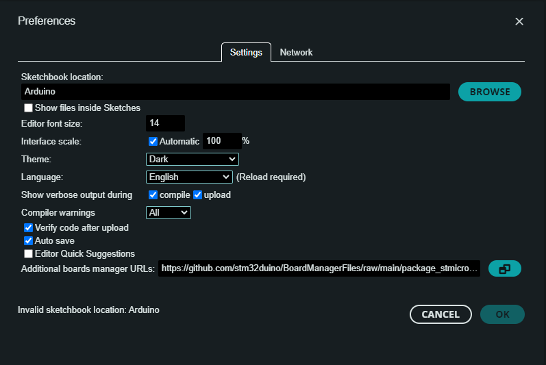
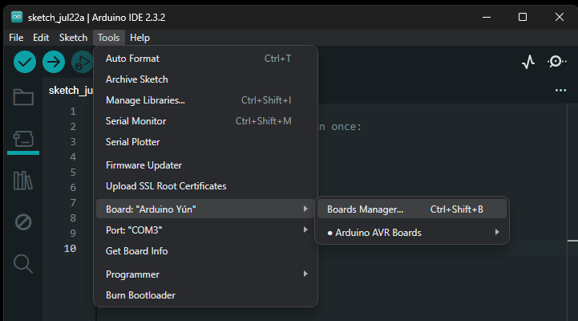
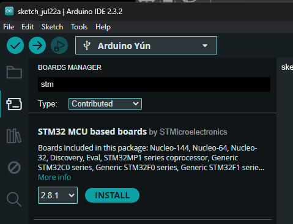
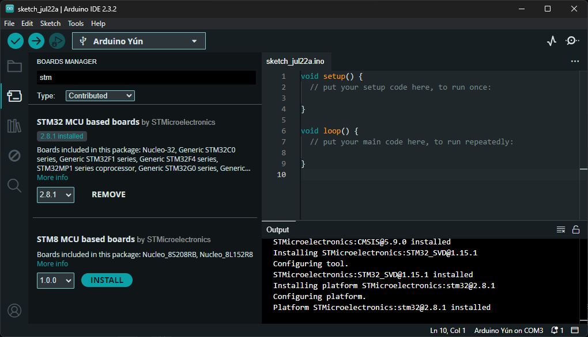
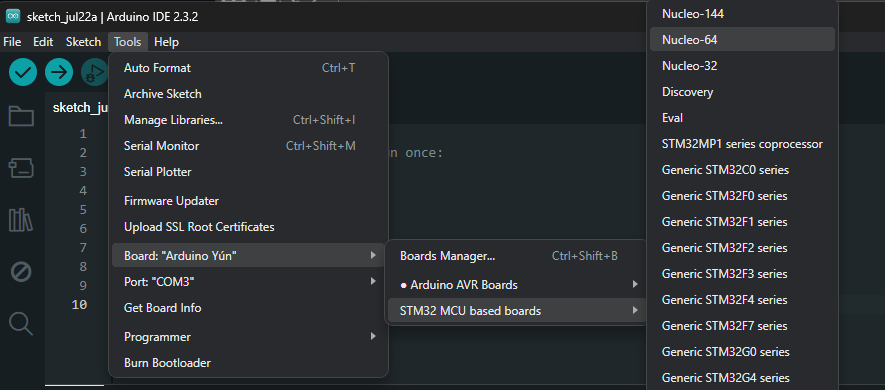
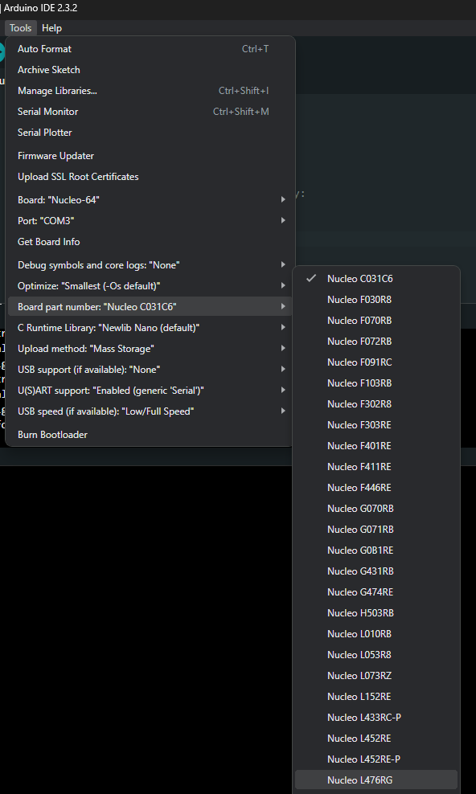
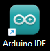
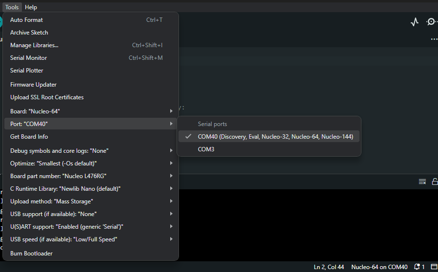
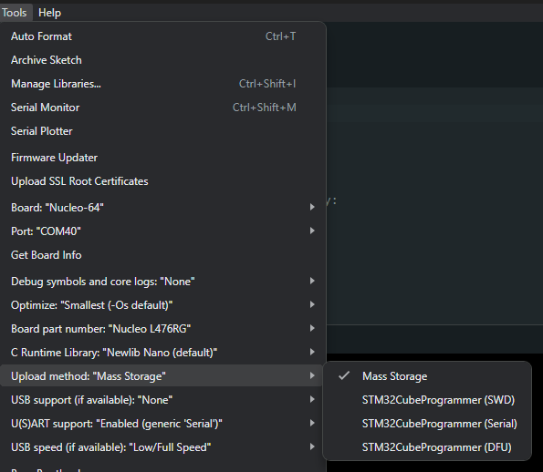

> [!WARNING]
> Since core release 2.8.0, only Arduino IDE 2 is supported.
> To use Legacy IDE (1.8.X), see the [Getting Started_V1](Getting-Started_V1.md)

# Install Arduino.cc IDE

Download and install [Arduino IDE 2](https://www.arduino.cc/en/software) for the required OS.
([Windows](https://docs.arduino.cc/software/ide-v2/tutorials/getting-started/ide-v2-downloading-and-installing/#windows), [Linux](https://docs.arduino.cc/software/ide-v2/tutorials/getting-started/ide-v2-downloading-and-installing/#linux) or [macOS](https://docs.arduino.cc/software/ide-v2/tutorials/getting-started/ide-v2-downloading-and-installing/#macos) instructions)

## About Boards manager concept
Arduino.cc IDE allows to add easily new board thanks the "**Boards Managers**".
More information about "**Boards Managers**" is available on Arduino.cc official website:

[Installing a Board Package in the IDE 2](https://docs.arduino.cc/software/ide-v2/tutorials/ide-v2-board-manager)

The corresponding STM32 cores packages are provided thanks to:

https://github.com/stm32duino/BoardManagerFiles

Follow the below steps to get STM32 boards installed to your Arduino IDE.

# Add STM32 boards support to Arduino
This is the needed step to get STM32 targets added to Arduino.
So carefully follow the following steps.

## Installing STM32 Cores

1- Launch Arduino.cc IDE. Click on "**File**" menu and then "**Preferences**".

The "**Preferences**" dialog will open, then add the following link to the "*Additional Boards Managers URLs*" field:

https://github.com/stm32duino/BoardManagerFiles/raw/main/package_stmicroelectronics_index.json

Click "**Ok**"

2- Click on "**Tools**" menu and then "**Boards > Boards Manager**" or use the underlined icon on the left side bar:

The board manager will open and you will see a list of installed and available boards. 

Select "**Contributed**" type.

Select the "**STM32 MCU based boards**" and click on install.

After installation is complete a "*\<version> installed*" tag appears below the core name.

You can close the Board Manager.

Now you can find the STM32 boards package in the "**Board**" menu.

Select the desired boards series: _Nucleo-64 / Nucleo-144 / Discovery / ..._

Then you can find the Nucleo-64 boards available in a sub-menu of the "Tools" menu.

## Extra step

To upload through SWD (STLink), Serial or DFU, [STM32CubeProgrammer](https://www.st.com/en/development-tools/stm32cubeprog.html) needs to be installed. See [Upload-methods#stm32cubeprogrammer](Upload-methods.md).

## Troubleshooting

If you have any issue to download/use a package, you could [file an issue on Github](https://github.com/stm32duino/BoardManagerFiles/issues/new).

### Proxy
If you have any issue to download a package, ensure to not be behind a proxy.

Else configure the proxy in the Arduino.cc IDE (open the "**Preferences**" dialog and select "**Network**" tab).

# Configuring IDE 
1. Connect a board to the computer USB port. For this example: [Nucleo L476RG]

2. Launch the Arduino software

    

3. Select the [Nucleo L476RG] board in two steps:

a. From the "**Tools > Board**" menu, select the STM32 boards groups: _Nucleo-64_

  

b. Then from the "**Tools > Board part number**" menu, select the [Nucleo L476RG]

  

3. Select the serial port from the "**Tools > Port**" menu

    * On Mac, it's something like _/dev/tty.usbmodem-1511_.
    * On Windows, it's often the highest-numbered COM port. In this example, it's _COM40_
    * On Linux, it's something like _/dev/ttyACM0_.

    (Or unplug the board, check the menu, and then plug the board and check what new port appears)

  

## Upload methods
Depending of the board, several upload methods could be proposed, thanks the "**Tools > Upload Method**" menu.

See [Upload methods](Upload-methods.md) for more details.

# Examples
* [Blink example](examples/Blink-example.md)

[Nucleo L476RG]: http://www.st.com/en/evaluation-tools/nucleo-l476rg.html