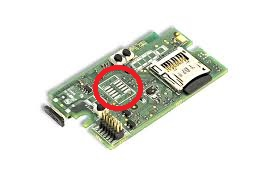
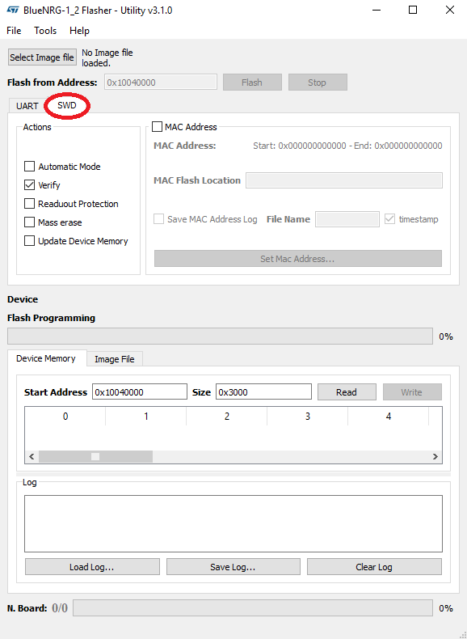
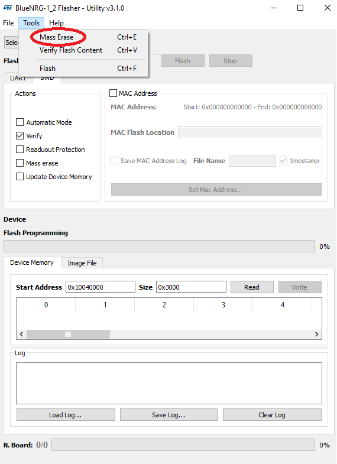
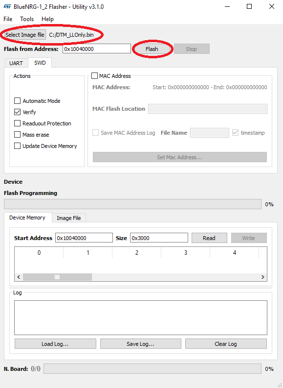
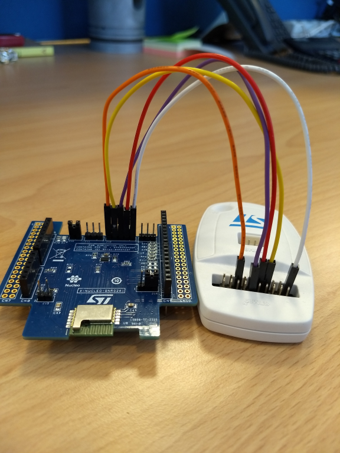
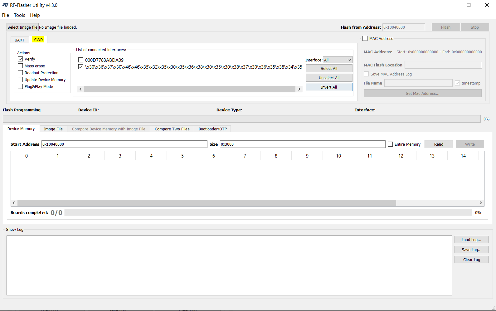
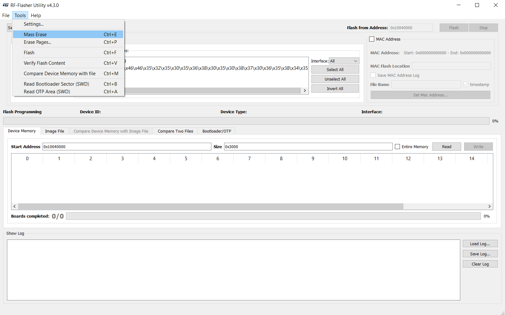
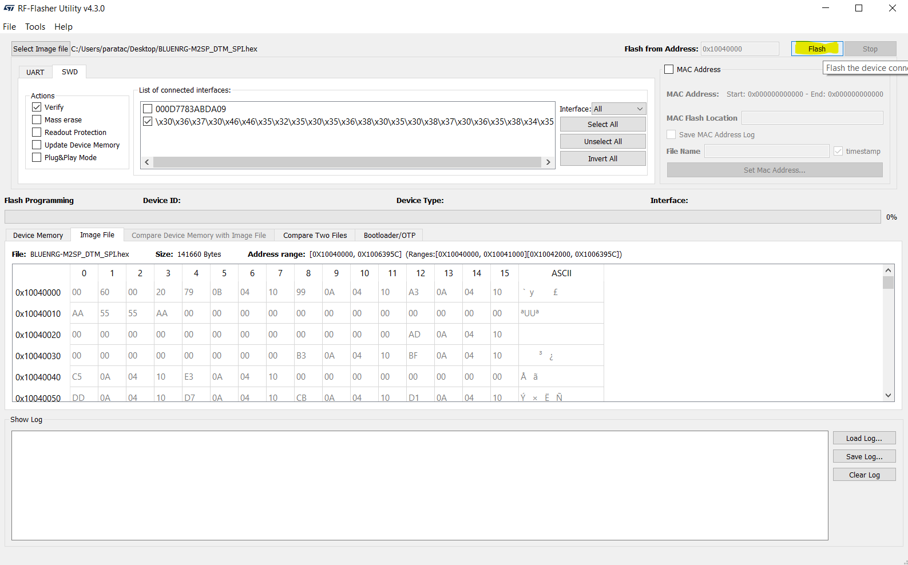

 * [with STEVAL_MKSBOX1V1](#stm32duinoble-with-steval_mksbox1v1)
 * [with X-NUCLEO-BNRG2A1](#stm32duinoble-with-x-nucleo-bnrg2a1)

# STM32duinoBLE with STEVAL_MKSBOX1V1

STM32duinoBLE library does not work with the stock firmware that is loaded in the BLE module of STEVAL-MKSBOX1V1.
For this reason, first of all, it is needed to solder on STEVAL-MKSBOX1V1 a JTAG/SWD 0.05" pitch 10pin male connector in the apposite space of the PCB.

Then you can use a standard ST-Link V2-1 with a JTAG/SWD 0.05" pitch 10pin to 20pin IDC cable together with [STSW-BNRGFLASHER](https://www.st.com/content/st_com/en/products/embedded-software/wireless-connectivity-software/stsw-bnrgflasher.html) software tool (currently available only for Windows PC) in order to update the firmware of the BLE module of STEVAL-MKSBOX1V1.

First of all, install the ST BlueNRG-1_2 Flasher Utility and open it, then select the SWD tab:

Erase the flash memory of the BlueNRG-1 chip:

Download the archive [STEVAL-MKSBOX1V1.zip] that contains the Link Layer Only firmware named `DTM_LLOnly.bin` for the BLE module.

Load the Link Layer Only firmware in the ST BlueNRG-1_2 Flasher Utility and then press the "Flash" button:

If you need to restore the stock firmware of the BLE module of STEVAL-MKSBOX1V1, you can repeat the procedure using the firmware image `DTM_Full.bin` included in the same archive [STEVAL-MKSBOX1V1.zip].

# STM32duinoBLE with X-NUCLEO-BNRG2A1

STM32duinoBLE library could not work with the stock firmware that is loaded in the BLE module of X-NUCLEO-BNRG2A1 expansion board.

For this reason, first of all, it is needed to solder on X-NUCLEO-BNRG2A1, if it is not soldered, a 0 Ohm resistor at R117.

Then you can use a standard ST-Link V2-1 with 5 jumper wires female-female together with [RF-Flasher Utility](https://www.st.com/en/embedded-software/stsw-bnrgflasher.html) software tool (currently available only for Windows PC) in order to update the firmware of the BLE module of X-NUCLEO-BNRG2A1.

You need to connect the J12 pins of the X-NUCLEO-BNRG2A1 to the pins of the ST-Link V2-1 as shown in the picture below.

In particular we have the following connections:

| | J12 | ST-Link V2-1 |
| --- | --- | --- |
| Pin | 1 | 1  |
| Pin | 2 | 9  |
| Pin | 3 | 12 |
| Pin | 4 | 7  |
| Pin | 5 | 15 |

First of all, install the RF-Flasher Utility and open it, then select the SWD tab:

Erase the flash memory of the BlueNRG-2 chip:

Download the archive [X-NUCLEO-BNRG2A1.zip] that contains a new version of the firmware for the BLE module name `LUENRG-M2SP_DTM_SPI.hex`.

Load the new firmware in the RF-Flasher Utility and then press the "Flash" button:

If you should find some issues during the update process, you can try to repeat the procedure closing the J15 jumper on the X-NUCLEO-BNRG2A1 expansion board.

[STEVAL-MKSBOX1V1.zip]: https://github.com/stm32duino/wiki_contrib/releases/download/0.0.1/STEVAL-MKSBOX1V1.zip
[X-NUCLEO-BNRG2A1.zip]: https://github.com/stm32duino/wiki_contrib/releases/download/0.0.1/X-NUCLEO-BNRG2A1.zip