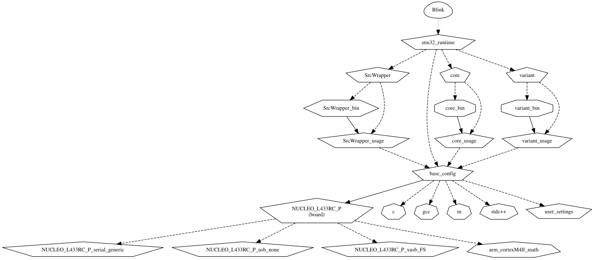

This page will discuss how to customize your project beyond the functions provided with Arduino_Core_STM32, using some standard CMake features.
Hence, knowledge of both CMake and the STM32 CMake framework is assumed.
Regarding the latter, an [`insight()`](./Functions-reference.md#insights) can be useful, namely LOGIC_STRUCTURE.

Below is the logic structure of the simplest example, the Blink sketch.
The following sections may refer to it to illustrate their points.




# Adding new settings to the build

Depending on the particular setting, CMake provides several functions:
- [`target_compile_definitions()`](https://cmake.org/cmake/help/latest/command/target_compile_definitions.html)
- [`target_compile_options()`](https://cmake.org/cmake/help/latest/command/target_compile_options.html)
- [`target_include_directories()`](https://cmake.org/cmake/help/latest/command/target_include_directories.html)
- [`target_link_directories()`](https://cmake.org/cmake/help/latest/command/target_link_directories.html)
- [`target_link_libraries()`](https://cmake.org/cmake/help/latest/command/target_link_libraries.html)
- [`target_link_options()`](https://cmake.org/cmake/help/latest/command/target_link_options.html)
- [`target_sources()`](https://cmake.org/cmake/help/latest/command/target_sources.html)

Most of these commands make use of the `PUBLIC`, `INTERFACE` or `PRIVATE` keywords.
- `PUBLIC` and `INTERFACE` will apply the setting to all the dependers of the target in question;
- `INTERFACE` and `PRIVATE` apply the setting to the target itself.

[Here](https://cmake.org/cmake/help/latest/manual/cmake-commands.7.html) is a comprehensive list of commands that can be used in a project.

# Where to add the settings

Several interface targets are of interest when the settings are to affect more than just the user sketch:
- `base_config` is depended upon by all the project (core, libraries, sketch);
- The targets ending in  `_usage` contain settings that are propagated upwards through the tree;
  these are useful when the scope of the setting is more specific.

It is also possible to add `PRIVATE` build settings directly on the code targets; e.g., to the sketch target.
However, a good practice is to instead create additional INTERFACE targets to put these flags in,
and make it a dependency of other parts of the project, using [`target_link_libraries()`](https://cmake.org/cmake/help/latest/command/target_link_libraries.html).

Some code part come in three targets, e.g., `core`, `core_bin`, `core_usage`.
The actual source files always are in the `_bin` target; that is to say, when there are source files (think of precompiled Arduino libraries).
`*_usage` gathers "public" settings to be used in that that target, and also by the dependers.
Lastly, the bare name target is just a wrapper are the previous two.

# Change the way CMake builds the project

Some variables affect the way CMake builds the project.
They can be specified either in a CMakeLists.txt, or (preferably) on the command-line, with the following syntax:
```sh
cmake -S ... -B ... -DVARIABLE=VALUE
```
_(The value is mandatory; use `1`, `ON` or `YES` as boolean true value.)_

A comprehensive list of such variables is defined in the [CMake documentation](https://cmake.org/cmake/help/latest/manual/cmake-variables.7.html); some of the most relevant ones are listed below.

- [`CMAKE_DISABLE_PRECOMPILE_HEADERS`](https://cmake.org/cmake/help/latest/variable/CMAKE_DISABLE_PRECOMPILE_HEADERS.html)
- [`CMAKE_INCLUDE_CURRENT_DIR`](https://cmake.org/cmake/help/latest/variable/CMAKE_INCLUDE_CURRENT_DIR.html)
- [`CMAKE_INTERPROCEDURAL_OPTIMIZATION`](https://cmake.org/cmake/help/latest/variable/CMAKE_INTERPROCEDURAL_OPTIMIZATION.html) (equivalent to the `LTO` switch in [`overall_settings()`](./Functions-reference.md#overall_settings))
- [`CMAKE_UNITY_BUILD`](https://cmake.org/cmake/help/latest/variable/CMAKE_UNITY_BUILD.html)
- [`EXECUTABLE_OUTPUT_PATH`](https://cmake.org/cmake/help/latest/variable/EXECUTABLE_OUTPUT_PATH.html)

CMake is also affected by some environment variables (doc [here](https://cmake.org/cmake/help/latest/manual/cmake-env-variables.7.html)), e.g.:
- [`CMAKE_BUILD_PARALLEL_LEVEL`](https://cmake.org/cmake/help/latest/envvar/CMAKE_BUILD_PARALLEL_LEVEL.html)
- [`CMAKE_GENERATOR`](https://cmake.org/cmake/help/latest/envvar/CMAKE_GENERATOR.html) (_usful to omit the `-G` on each CMake call_)
- `CC`, `CXX`, `CFLAGS`, `CXXFLAGS`, `LDFLAGS` with the same meaning as with `make`

Please note that not all features work, or even make sense, for embedded projects.
Caution and testing are advised when dealing with the variables listed here.
