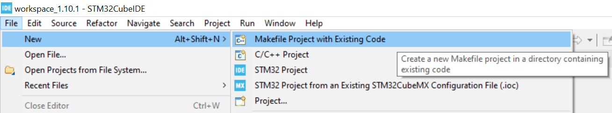
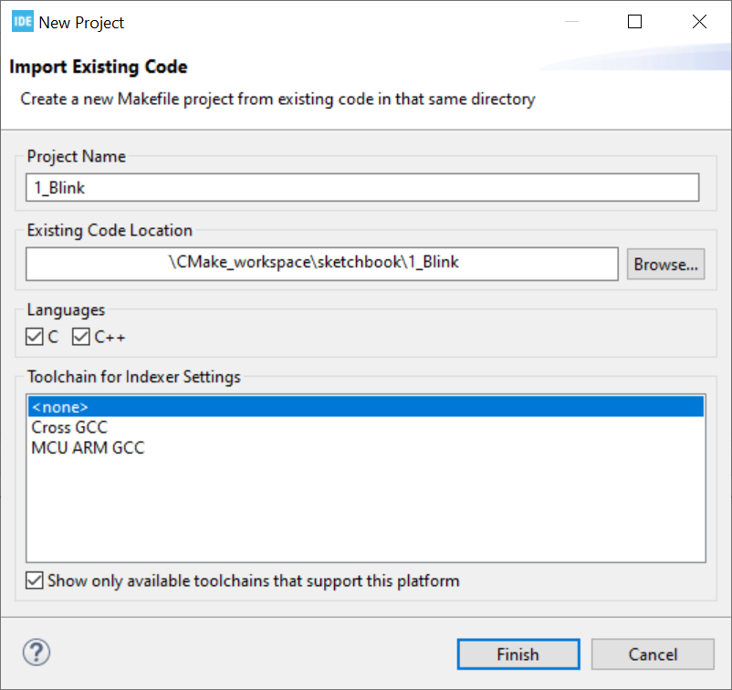
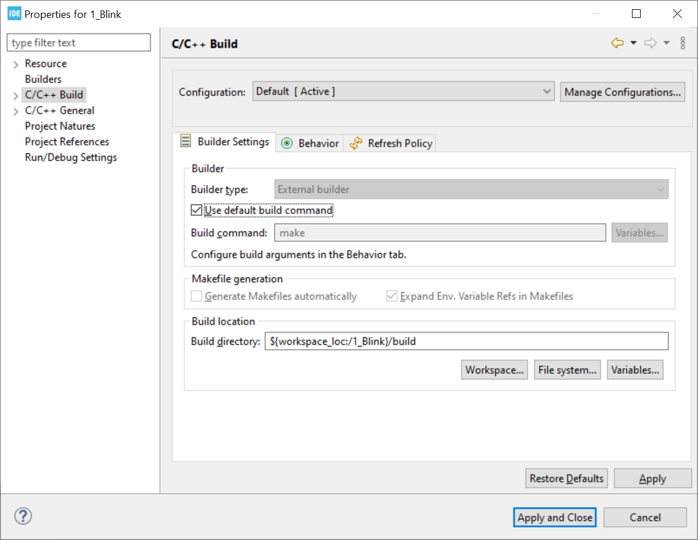
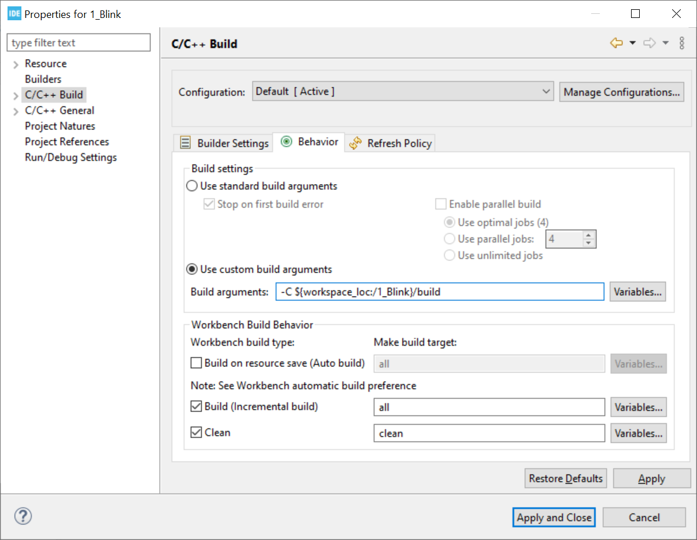
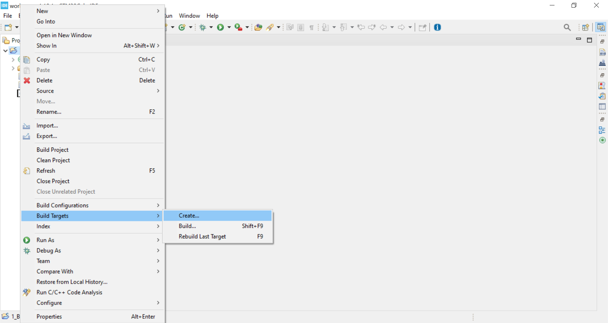
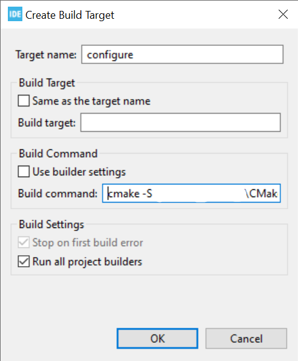
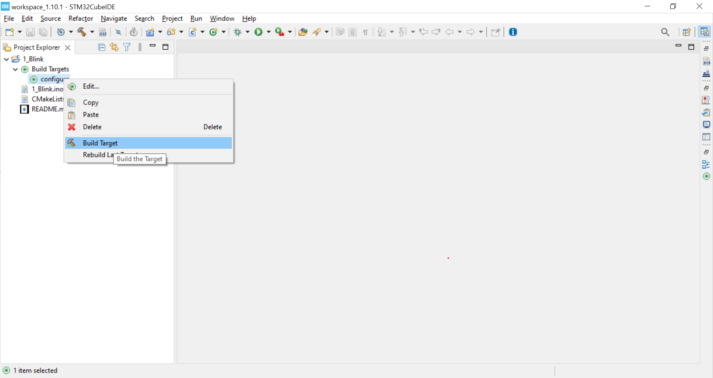
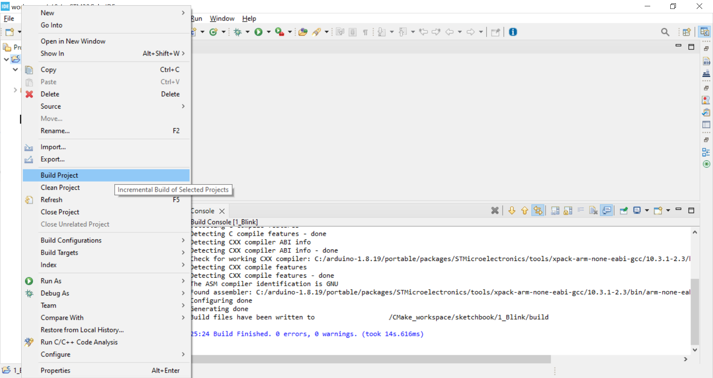

CMake projects may be integrated in various IDEs.

Some IDEs sport a CMake plug-in, notably VScode.
This is the easy case -- please refer to the documentation of the relevant plug-in.

Unfortunately, ST's Cube IDE does not have such a plug-in. A procedure to handle CMake projects nonetheless,
using its built-in support for Makefiles, is detailed below.

## Requirements

The same requirements as detailed in the [Setup](Setup.md) page for shell users apply.
The walkthrough below was performed using CubeIDE version 1.10.1 ; some steps may differ when using another.

## Walkthrough

The first step is to create or import a __"Makefile Project with Existing Code"__:



-----------------

Then browse for the project's location, and leave all other settings to default as illustrated below:



-----------------

The next step is to fill in the build settings.
Right click on the project, hit "Properties" (or `Alt`+`Enter`), then go to the "C/C++ build" section.
Fill in the "Builder Settings" and "Behavior" tabs as follows
(be sure to replace the build location with the relevant value for your project).




You may also change the build command to "ninja"; this is known to be much more efficient, in terms of build time, than Make.

-----------------

Once this is done, there remains to tell CubeIDE how to run CMake.
Right click on the project, hit "Build targets" -> "Create" (or `Shift`+`F9`, "Add").



Fill the window that pops up as follows:



Build command :
```sh
# if you stuck with Make in the previous step
cmake -S [source folder] -B [build folder] -G Unix\ Makefiles

# or, if you picked Ninja earlier,
cmake -S [source folder] -B [build folder] -G Ninja
```

For the source and build folder, you can use one of Cube's automatic variables, such as `${workspace_loc:/1_Blink}/build`, as in the project settings.
Make sure the build folder (`-B`) matches the value you passed in the project build configuration step!

-----------------

Now, all the configuration steps are done.

To run CMake, build the target you created in the previous step (or hit `F9`):



To or rebuild the project, hit `Ctrl`+`B`, or right-click on the project -> "Build project".


