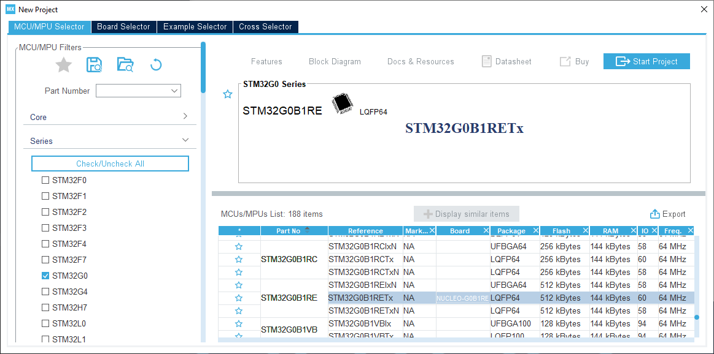
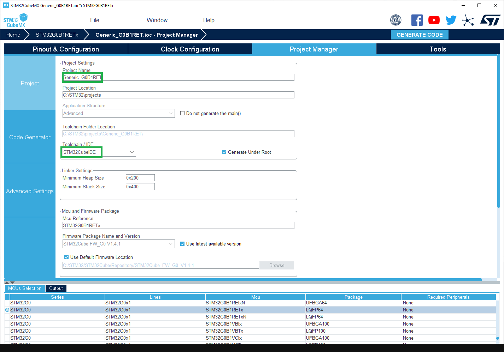
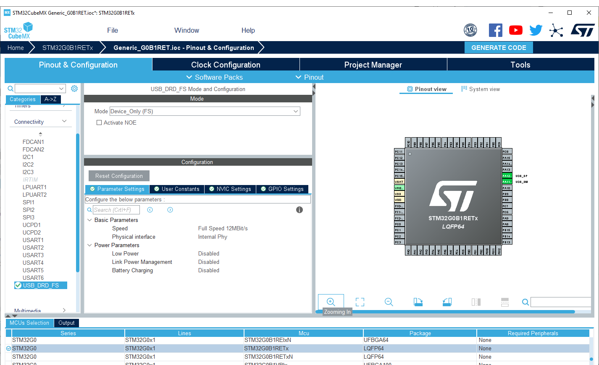
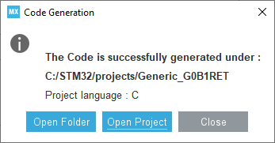

# Define a new generic variant

Before adding a specific board, it is a good practice to add the generic entry of the STM32 MCU as it is possible to use it with the specific board.

> [!NOTE]
> A folder name can reference several MCU references so several boards entry could be added. Not only the one of the specific board.

> [!TIP]
> The example of all the steps below is available in [PR #1398](https://github.com/stm32duino/Arduino_Core_STM32/pull/1398).

### 1 - Get the [Arduino_Core_STM32] git repository

> [!NOTE]
> If you do not plan to share your board, you can skip this step.

To be able to contribute and create a [Pull Requests](https://help.github.com/articles/about-pull-requests/) you should use the [Arduino_Core_STM32] git repository instead of the packaged version

See [Using git repository](../Using-git-repository.md).

### 2 - Find the MCU folder in the core

Go to the [variants folder] of the STM32 core (See [STM32 core source files](../Where-are-sources.md#stm32-core-source-files)).

**Example**: To add variant for the [Nucleo-G0B1RE] search for the folder name including `G0B1RET` reference in the STM32G0xx subfolder of the [variants folder]. In this case:

[`G0B1R(B-C-E)T_G0C1R(C-E)T`](https://github.com/stm32duino/Arduino_Core_STM32/blob/main/variants/STM32G0xx/G0B1R(B-C-E)T_G0C1R(C-E)T)

Several files are present as stated in [Generated variant files](overview.md#generated-variant-files).
It misses only the default linker script named `ldscript.ld` and the Generic System Clock configuration.

> [!IMPORTANT]
> [STM32CubeMX] is used to generate them. So it have to be installed first.

### 3 - Create new project with [STM32CubeMX]

**1. Open [STM32CubeMX] and create a new project.** Select the targeted MCU; this example uses the `STM32G0B1RET`.

??? example "Create new CubeMX project..."

    

**2. Configure the project in the _Project Manager_ tab:**

- Set a project name
- Set a project location
- Select the IDE: _**STM32CubeIDE**_

??? example "Configure the project..."

    

### 4 - System Clock configuration

`generic_clock.c` contains the default system clock configuration which is empty by default. So the default clock
at reset will be used as stated by the warning:

```c
WEAK void SystemClock_Config(void)
{
  /* SystemClock_Config can be generated by STM32CubeMX */
#warning "SystemClock_Config() is empty. Default clock at reset is used."
}
```

> [!IMPORTANT]
>  For generic board the internal clock is used: mainly `HSI` or `CSI` or `MSI` depending of the series.

1. Go to **_Pinout_** tab, enable the peripherals which require specific clock configuration (not needed for peripherals clocked by `HCLKx`, or `APBx` clock).

    Clock configuration means `clock mux selection` (if any) and `frequency`, see the [STM32CubeMX] user manual to
    get help on the **Clock Configuration** tab and refer to the mcu documentation to get each peripheral constraints.

    Usually below peripheral have to be enabled and input clock source constraint have to be checked. [STM32CubeMX] will help and warn if clock configuration is not correct else refer to the mcu documentation:

    - `USB`: **48MHz** clock source.
    - `SDIO` or `SDMMC`: **48MHz**
    - `LPUARTx`: clock source must be in the range: **[3 x baud rate, 4096 x baud rate]** so ensure to be able to use `9600 bps`.
    - `ADC` and/or `DAC`: on some series they are specific constraints.

    In this example only `USB` needs to be enabled as other peripherals default clock are correct by default.

    ??? example "Pinout configuration..."

         

2. Configure the clock:

    - Set `PLL Source Mux` to `HSI` if it exists else set `HSI` as `System Clock Mux`. Or any other internal clock.
    - Try to set the CPU clock and `HCLK` to the maximum frequencies, [STM32CubeMX] will automatically configure the clock tree and resolve conflict if any. Sometimes due to some constraints (ex: USB) maximum frequency is not reachable.

3. Generate the code by clicking on **Generate Code** button and open the folder.

    ??? example "Generate the project..."

         


### 5 - Add the default linker script

Copy the `STM32YYxxxxxx_FLASH.ld` generated by [STM32CubeMX] in the variant folder and rename it: `ldscript.ld`

**Example** for the [Nucleo-G0B1RE]: `STM32G0B1RETX_FLASH.ld`

> [!IMPORTANT]
> In order to have a common linker script for all MCU the `RAM` and `FLASH` definitions have to be updated.

As the linker script is preprocessed it is possible to use some definitions based on board entry and defined by the [`platform.txt`](https://github.com/stm32duino/Arduino_Core_STM32/blob/main/platform.txt).

```opts
-Wl,--defsym=LD_FLASH_OFFSET={build.flash_offset} -Wl,--defsym=LD_MAX_SIZE={upload.maximum_size} -Wl,--defsym=LD_MAX_DATA_SIZE={upload.maximum_data_size}
```

With:

- `LD_FLASH_OFFSET`: Flash base offset mainly used when a custom bootloader is used. Default set to 0.
- `LD_MAX_DATA_SIZE`: RAM size
- `LD_MAX_SIZE`: Flash size

Edit the `ldscript.ld` file accordingly:

```diff
 /* Memories definition */
 MEMORY
 {
-  RAM    (xrw)    : ORIGIN = 0x20000000,   LENGTH = 144K
-  FLASH    (rx)    : ORIGIN = 0x8000000,   LENGTH = 512K
+  RAM    (xrw)    : ORIGIN = 0x20000000,   LENGTH = LD_MAX_DATA_SIZE
+  FLASH    (rx)    : ORIGIN = 0x8000000 + LD_FLASH_OFFSET, LENGTH = LD_MAX_SIZE - LD_FLASH_OFFSET
 }
```

### 6 - Update the default System Clock

Use [STM32CubeMX] to configure the MCU's internal clock sources. A generic variant must not assume a board-specific crystal or external clock, so use the internal source supported by the MCU family, such as `HSI`, `CSI`, `MSI`, or `HSI48` when available.

In CubeMX, select the exact MCU and package, enable the internal oscillator required by the family, and configure the PLL and clock tree. Check the generated `SystemCoreClock`, `HCLK`, and APB frequencies against the MCU limits, including voltage scaling and flash latency. Resolve all CubeMX clock warnings before copying the generated `SystemClock_Config()` body into `generic_clock.c`.

For a generic variant, only configure peripheral clocks that are common to every board using the MCU variant. Check the internal-clock requirements of enabled peripherals, including ADC, DAC, timers, I2C, and any family-specific kernel clocks. If USB or SDIO/SDMMC is enabled by default, provide the exact 48 MHz source required by that peripheral. Otherwise, leave board-dependent peripheral clock selection to the specific board variant.

??? example "Example"

        ```diff
         WEAK void SystemClock_Config(void)
         {
        -  /* SystemClock_Config can be generated by STM32CubeMX */
        -#warning "SystemClock_Config() is empty. Default clock at reset is used."
        +  RCC_OscInitTypeDef RCC_OscInitStruct = {};
        +  RCC_ClkInitTypeDef RCC_ClkInitStruct = {};
        +  RCC_PeriphCLKInitTypeDef PeriphClkInit = {};
        +
        +  /** Configure the main internal regulator output voltage
        +  */
        +  HAL_PWREx_ControlVoltageScaling(PWR_REGULATOR_VOLTAGE_SCALE1);
        +  /** Initializes the RCC Oscillators according to the specified parameters
        +  * in the RCC_OscInitTypeDef structure.
        +  */
        +  RCC_OscInitStruct.OscillatorType = RCC_OSCILLATORTYPE_HSI | RCC_OSCILLATORTYPE_HSI48;
        +  RCC_OscInitStruct.HSIState = RCC_HSI_ON;
        +  RCC_OscInitStruct.HSI48State = RCC_HSI48_ON;
        +  RCC_OscInitStruct.HSIDiv = RCC_HSI_DIV1;
        +  RCC_OscInitStruct.HSICalibrationValue = RCC_HSICALIBRATION_DEFAULT;
        +  RCC_OscInitStruct.PLL.PLLState = RCC_PLL_ON;
        +  RCC_OscInitStruct.PLL.PLLSource = RCC_PLLSOURCE_HSI;
        +  RCC_OscInitStruct.PLL.PLLM = RCC_PLLM_DIV1;
        +  RCC_OscInitStruct.PLL.PLLN = 8;
        +  RCC_OscInitStruct.PLL.PLLP = RCC_PLLP_DIV2;
        +  RCC_OscInitStruct.PLL.PLLQ = RCC_PLLQ_DIV2;
        +  RCC_OscInitStruct.PLL.PLLR = RCC_PLLR_DIV2;
        +  if (HAL_RCC_OscConfig(&RCC_OscInitStruct) != HAL_OK) {
        +    Error_Handler();
        +  }
        +  /** Initializes the CPU, AHB and APB buses clocks
        +  */
        +  RCC_ClkInitStruct.ClockType = RCC_CLOCKTYPE_HCLK | RCC_CLOCKTYPE_SYSCLK
        +                                | RCC_CLOCKTYPE_PCLK1;
        +  RCC_ClkInitStruct.SYSCLKSource = RCC_SYSCLKSOURCE_PLLCLK;
        +  RCC_ClkInitStruct.AHBCLKDivider = RCC_SYSCLK_DIV1;
        +  RCC_ClkInitStruct.APB1CLKDivider = RCC_HCLK_DIV1;
        +
        +  if (HAL_RCC_ClockConfig(&RCC_ClkInitStruct, FLASH_LATENCY_2) != HAL_OK) {
        +    Error_Handler();
        +  }
        +  /** Initializes the peripherals clocks
        +  */
        +  PeriphClkInit.PeriphClockSelection = RCC_PERIPHCLK_USB;
        +  PeriphClkInit.UsbClockSelection = RCC_USBCLKSOURCE_HSI48;
        +  if (HAL_RCCEx_PeriphCLKConfig(&PeriphClkInit) != HAL_OK) {
        +    Error_Handler();
        +  }
         }
        ```


> [!TIP]
> Pay attention to the default value of HAL RCC structures. CubeMx set it to `0` but it produces warning.
> Simply remove the `0` like this:

```diff
-  RCC_OscInitTypeDef RCC_OscInitStruct = {0};
-  RCC_ClkInitTypeDef RCC_ClkInitStruct = {0};
+  RCC_OscInitTypeDef RCC_OscInitStruct = {};
+  RCC_ClkInitTypeDef RCC_ClkInitStruct = {};
```

### 7 - Declare the board

It is still to add the menu and add relevant information (Flash and SRAM sizes, ...)

> [!TIP]
> See [Arduino boards.txt specification] for further options.

> [!WARNING]
> Pay attention to alphabetical order.

Edit [`boards.txt`](https://github.com/stm32duino/Arduino_Core_STM32/blob/main/boards.txt) file, then:

1. Find the menu part where to add the generic entry. In this example the `GenG0` menu.
2. Copy all the boards entry from the `board_entry.txt` file to this section.
3. Check if the `build.product_line=` is correct and match the `STM32YYXXxx` MCU version.
4. Check the `upload.maximum_size=` and `upload.maximum_data_size=`, sometimes not all the flash or RAM are available because they are not contiguous.


??? example "Example"

    ```diff
     GenG0.menu.pnum.GENERIC_G081RBTX.build.variant=STM32G0xx/G071R(6-8)T_G071RB(I-T)_G081RB(I-T)

    +# Generic G0B1RBTx
    +GenG0.menu.pnum.GENERIC_G0B1RBTX=Generic G0B1RBTx
    +GenG0.menu.pnum.GENERIC_G0B1RBTX.upload.maximum_size=131072
    +GenG0.menu.pnum.GENERIC_G0B1RBTX.upload.maximum_data_size=147456
    +GenG0.menu.pnum.GENERIC_G0B1RBTX.build.board=GENERIC_G0B1RBTX
    +GenG0.menu.pnum.GENERIC_G0B1RBTX.build.product_line=STM32G0B1xx
    +GenG0.menu.pnum.GENERIC_G0B1RBTX.build.variant=STM32G0xx/G0B1R(B-C-E)T_G0C1R(C-E)T
    +
    +# Generic G0B1RCTx
    +GenG0.menu.pnum.GENERIC_G0B1RCTX=Generic G0B1RCTx
    +GenG0.menu.pnum.GENERIC_G0B1RCTX.upload.maximum_size=262144
    +GenG0.menu.pnum.GENERIC_G0B1RCTX.upload.maximum_data_size=147456
    +GenG0.menu.pnum.GENERIC_G0B1RCTX.build.board=GENERIC_G0B1RCTX
    +GenG0.menu.pnum.GENERIC_G0B1RCTX.build.product_line=STM32G0B1xx
    +GenG0.menu.pnum.GENERIC_G0B1RCTX.build.variant=STM32G0xx/G0B1R(B-C-E)T_G0C1R(C-E)T
    +
    +# Generic G0B1RETx
    +GenG0.menu.pnum.GENERIC_G0B1RETX=Generic G0B1RETx
    +GenG0.menu.pnum.GENERIC_G0B1RETX.upload.maximum_size=524288
    +GenG0.menu.pnum.GENERIC_G0B1RETX.upload.maximum_data_size=147456
    +GenG0.menu.pnum.GENERIC_G0B1RETX.build.board=GENERIC_G0B1RETX
    +GenG0.menu.pnum.GENERIC_G0B1RETX.build.product_line=STM32G0B1xx
    +GenG0.menu.pnum.GENERIC_G0B1RETX.build.variant=STM32G0xx/G0B1R(B-C-E)T_G0C1R(C-E)T
    +
    +# Generic G0C1RCTx
    +GenG0.menu.pnum.GENERIC_G0C1RCTX=Generic G0C1RCTx
    +GenG0.menu.pnum.GENERIC_G0C1RCTX.upload.maximum_size=262144
    +GenG0.menu.pnum.GENERIC_G0C1RCTX.upload.maximum_data_size=147456
    +GenG0.menu.pnum.GENERIC_G0C1RCTX.build.board=GENERIC_G0C1RCTX
    +GenG0.menu.pnum.GENERIC_G0C1RCTX.build.product_line=STM32G0C1xx
    +GenG0.menu.pnum.GENERIC_G0C1RCTX.build.variant=STM32G0xx/G0B1R(B-C-E)T_G0C1R(C-E)T
    +
    +# Generic G0C1RETx
    +GenG0.menu.pnum.GENERIC_G0C1RETX=Generic G0C1RETx
    +GenG0.menu.pnum.GENERIC_G0C1RETX.upload.maximum_size=524288
    +GenG0.menu.pnum.GENERIC_G0C1RETX.upload.maximum_data_size=147456
    +GenG0.menu.pnum.GENERIC_G0C1RETX.build.board=GENERIC_G0C1RETX
    +GenG0.menu.pnum.GENERIC_G0C1RETX.build.product_line=STM32G0C1xx
    +GenG0.menu.pnum.GENERIC_G0C1RETX.build.variant=STM32G0xx/G0B1R(B-C-E)T_G0C1R(C-E)T
    +
     # Upload menu
    ```

### 8 - Verify your changes

Then verify your changes with the [CheckVariant example].

> [!Note]
> This example will print on the default `Serial` so ensure to use this one, same for the `LED_BUILTIN`.

> [!IMPORTANT]
> An issue with the Arduino IDE 2.x prevents the board to appears
> in the menu. Follow this workaround to get it working:
> [issue #1030](https://github.com/arduino/arduino-ide/issues/1030#issuecomment-1152005617)


[pin number]: ../../Pin-naming.md#arduino-pin-numbers-and-variant-aliases
[variants folder]: https://github.com/stm32duino/Arduino_Core_STM32/tree/main/variants
[Arduino boards.txt specification]: https://arduino.github.io/arduino-cli/latest/platform-specification/#boardstxt
[CheckVariant example]: https://github.com/stm32duino/STM32Examples/tree/main/examples/NonReg/CheckVariant
[Nucleo-G0B1RE]: https://www.st.com/en/evaluation-tools/nucleo-g0b1re.html
[STM32_open_pin_data]: https://github.com/STMicroelectronics/STM32_open_pin_data
[STM32CubeMX]: http://www.st.com/en/development-tools/stm32cubemx.html
[Arduino_Core_STM32]: https://github.com/stm32duino/Arduino_Core_STM32
