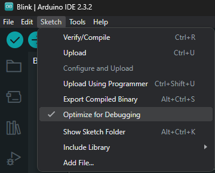
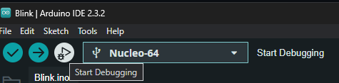
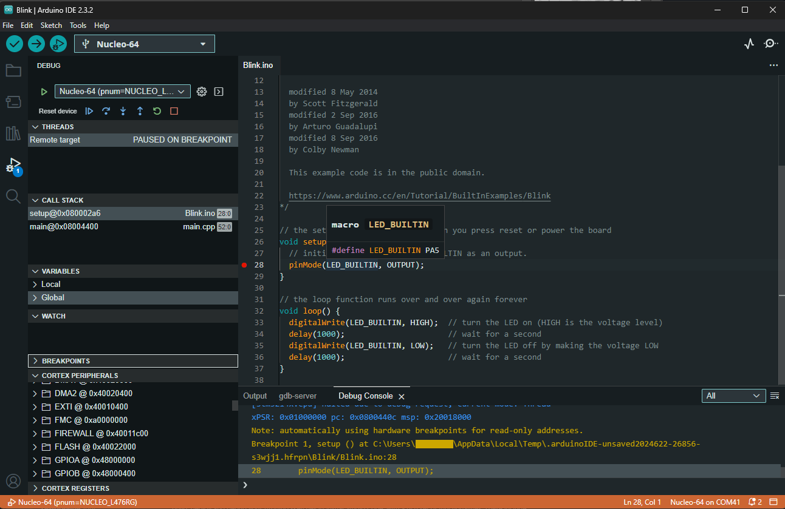
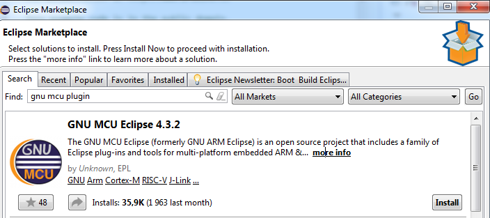
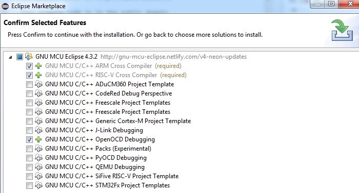

# How to debug

Below, some ways to debug:
 * [Arduino IDE 2 (Supported and recommended way)](#arduino-ide-2-supported-and-recommended-way)
 * [Eclipse and Sloeber](#eclipse-and-sloeber)
 * [PlatformIO](#platformio)
 * [Visual Studio and VisualGDB](#visual-studio-and-visualgdb)
 * [Visual Studio Code and Arduino extension](#visual-studio-code-and-arduino-extension)
 * [Command line GDB](#command-line-gdb)

> [!WARNING]
> **Only the Arduino IDE 2 is officially supported.**

# Arduino IDE 2 (Supported and recommended way)

> [!Note]
> Requires a [ST-Link/V2](https://www.st.com/content/st_com/en/products/development-tools/hardware-development-tools/hardware-development-tools-for-stm32/st-link-v2.html) or [ST-Link/V3](https://www.st.com/en/development-tools/stlink-v3set.html) device connected to the PC over USB and to the board via the SWD interface.

1. If not already done, [Getting Started](../Getting-Started.md#install-arduinocc-ide)

2. Configure the IDE to the desired board. Here the [Nucleo L476RG](http://www.st.com/en/evaluation-tools/nucleo-l476rg.html) which already includes a ST-Link.

  See [Getting Started](../Getting-Started.md#configuring-ide)

3. Open the Blink sketch from the "**File> Examples > 01.Basics > Blink**".

4. Select the "**Optimize for debugging**" in the "**Sketch**" menu:

  

5. Click the upload button

  See [Getting Started](../Getting-Started.md#upload-methods) to change the upload method.

  

6. Click the start debugging button:

  

  

> [!TIP]
> Refer to official documentation to see how [Using the Debugger](https://docs.arduino.cc/software/ide-v2/tutorials/ide-v2-debugger/#using-the-debugger).

# Eclipse and Sloeber
## 1 - Software requirements
### 1.1 - Install Eclipse C/C++ IDE
+	**If you do not have any Eclipse package installed** <br>
Download Eclipse installer from [Eclipse website](http://eclipse.org/downloads) , choose _**Eclipse IDE for C/C++ Developers**_ and follow the installer instructions . 

+ **If you already have an Eclipse packages (Java, Java EE, …) on your system** <br>
You can install the CDT (C/C++ Development Tooling ) plugin as follow :
 1. Launch _**"Eclipse > Help > Install New Software".**_<br>
 2.  In the _“**Work with**”_ section, choose: Oxygen - http://download.eclipse.org/releases/oxygen (depending on your Eclipse packages version).
 3.  In the _“**Name**”_ box, expand _“**Programming Language**”_ and choose _**“C/C+ Development Tools > Next > Finish”**_.<br>

**1.1.1.	Install OpenOCD from the GNU MCU Eclipse plug-ins** 

The GNU MCU Eclipse plug-ins provide multiple tools based on the GNU toolchains to ease project development. To use Eclipse debugging features, it is necessary to download OpenOCD, an open source software that provides debugging and in-system programming for embedded device.

Launch Eclipse, go to _**“Help > Eclipse Marketplace”**_ and search for the _**"GNU MCU plug-in"**_. <br>



In the tree view, expand _**“GNU MCU Eclipse {version}”**_ and uncheck all items. In previous versions, you had to choose the OpenOCD entry. Since there is no such entry, you cannot select it. OpenOCD will automatically be installed. Confirm and follow the recommended instructions. Then restart Eclipse.<br>



To finish the OpenOCD plug-in configuration, and for a simpler integration, install OpenOCD binaries by following the [“How to install the OpenOCD binaries”](https://gnu-mcu-eclipse.github.io/openocd/install/ 
) tutorial. This Guide will tell you to extract the openocd binaries to a specific path (Windows).

###  1.2 - Install Sloeber (The Arduino Eclipse Plugin) 
From the Eclipse main tab, go to _**“Help > Eclipse Marketplace”**_ and search for _**Sloeber**_. <br>
Download the _**"Sloeber plugin"**_ , follow the recommended instructions and restart Eclipse. <br>
By now, the main tab should look like the following:


### 1.3 - Install STM32 Cores
Open _**“Arduino > Preferences”**_.<br>
In the tree view that pops up, go to _**“Arduino > Third party index url’s”**_ and add the STM32 support package URL:

https://raw.githubusercontent.com/stm32duino/BoardManagerFiles/main/package_stmicroelectronics_index.json


Hit _**“Apply and Close”**_ then re-open the _**“Arduino > Preferences”**_ menu. The STM32 Core is now available in the _**“Platforms and Boards”**_ menu.


Select the latest core version and hit _**“Apply and Close”**_.

## 2 - Programming the boards
> [!TIP]
> Make sure your board is correctly connected before go any further.

There is multiple options to start a new project. 

--> _**Option A:**_ From the _**“Arduino“**_ menu, click on _**“New Sketch”**_. <br>
--> _**Option B:**_ Click on the new sketch icon directly from the toolbar.<br>
--> _**Option C:**_ From the _**“File > New > Project…”**_ click on _**“Arduino New Sketch”**_.

Regardless of the chosen method, set your _**“Project name”**_ and the _**“Location”**_ of your project. Then, push the _**“Next”**_ button.
Complete the Arduino required information (board type, port number …) form and click _**“Next”**_.

Do not forget to select the _**“Platform folder”**_ that corresponding to the STM32 Core version previously installed.


> [!NOTE]
> If you plan to debug, select "_**Debug (-g)**_" from the "_**Optimize**_" list else you will not have debugging symbols.

From there, you can create your own sketch or use pre-configured examples. <br>
In this case, we will try the _**“Blink”**_ example.<br>
From the _**“select code”**_ bar, apply _**“Sample sketch”**_ and then choose _**“Examples > 01.Basics > Blink”**_ and _**“Finish”**_.


> [!NOTE]
> As the GCC ARM Toolchain is provided by the STM32 core, you do not have to download it in order to program your board.

Use the _**“Arduino”**_ menu or the upload button on the toolbar to upload your sketch. If the setup is correct, the LED should blink on your board.

## 3 - Debugging Arduino Code

First, make sure your board can work with STLink. The debugger support is currently fully tested with the board supported by the STM32Core (Full list on [Supported boards section](https://github.com/stm32duino/Arduino_Core_STM32#supported-boards)). 

### 3.1 Software requirements

Two standard tools are required in order to debug the code: 
+  **GDB, the GNU Debugger**. The STM32 core provides a GDB executable. This executable is located in the arm-none-eabi-gcc binaires folder in your STM32 core package. The path should look like this one: 

```
<Eclipse installation path>\eclipse\arduinoPlugin\packages\STM32\tools\arm-none-eabi-gcc\6-2017-q2-update\bin\arm-none-eabi-gdb.exe
```
+  **OpenOCD**, installed in 1.1.1 section.

> [!IMPORTANT]
>  Make sure these tools are correctly installed on your platform before proceeding any further.

> [!IMPORTANT]
>  Do not forget to select "_**Debug (-g)**_" to the "_**Optimize**_" list in the "_**Arduino Board Selection**_" of your project else you will not have debugging symbols.

### 3.2 Setting up debug configuration 

If you are using sloeber directly, not CDT with the plugin. The you probably will not find the below mentioned menu "Debug Configurations" under "Run". This is, because you are in the arduino view. In this view, all "unnecessary" menus are hidden. To overcome this, you can change the view: 

You can choose the regular C/C++ view. 
Alternatively you can also reach the debug configurations menu by right-click on your project under the arduino view. 

From the _**“Run”**_ menu, select _**“Debug Configurations”**_.
Double-click on **_“GDB OpenOCD Debugging”_** to create a new configuration and set the configuration name.


Move to the _**“Debugger”**_ tab in order to configure OpenOCD and GDB. 

#### 3.2.1 Setting up OpenOCD

1. First, set the OpenOCD executable path. If OpenOCD was installed following the recommended instructions from the GNU MCU plug-in installation guide _(see section 1.1.1)_, Eclipse should auto detect the latest version of OpenOCD and you should be able to use global variable to define your path. Your  executable path should look like this one : 
```
        ${openocd_path}/${openocd_executable}
```

The _**“Actual executable”**_ field show the full executable path. 

2. Set the _**“GDB port”**_ to 3333 , the _**“Telnet port”**_ to 4444 and the _**“Tcl port”**_ to 6666.

3. Finally, set the debugger configuration in the _**“Config options”**_ field; specify the script path folder and configuration files (.cfg) related to your MCU. In this case, we use a Nucleo F030R8, so the configuration arguments are : 
```
        -s "${openocd_path}/../scripts" -f interface/stlink-v2-1.cfg -f target/stm32f0x.cfg
```


> [!IMPORTANT]
>  Do not forget to replace the config files with the version of the board you are using.

#### 3.2.1 Setting up GDB

In the _**“Debugger”**_ tab, scroll to the GDB Client setup field. 
 * Set the _**“Executable name”**_ field to the path of the arm-none-eabi-gdb executable by adding:
```
         ${A.COMPILER.PATH}/arm-none-eabi-gdb
```

By now, the _**“Debugger”**_ tab should look like the following: 


Move to the _**“Startup”**_ tab, scroll until the _**“Run/Restart Commands”**_ fields and add:<br> 
``` 
         monitor reset halt
         monitor reset init
```

Then go to the _**“Common”**_ tab and check _**“Debug”**_ and _**“Run”**_ in the _**“Display in favorites menu”**_.
Finally, click on _**“Apply”**_ and _**“Close”**_. 

### 3.3 Launching a debug session

Launch the debug session from the _**“Debug”**_ or _**“Run”**_ button in the toolbar.<br>
If the configuration process runs correctly, you will be able to see the debug capabilities of the chip in the Debug console (number of breakpoints, watchpoints, …).

If you are facing problems with messages like "binary not found" you should try to click on the drop down menu and then on your configuration instead of just click on the debug icon. 


Now, you can easily debug your code by using the Eclipse debug features including running step-by-step mode, live breakpoint, inspecting memory access, live view of variable contents and many more.


# PlatformIO

[PlatformIO](https://platformio.org/) is an open source ecosystem for IoT development. Cross-platform IDE and unified debugger. Remote unit testing and firmware updates.

It's built on top of GitHub's [Atom](https://atom.io/) and Microsoft's [Visual Studio Code](https://code.visualstudio.com/) – free, open source, and MIT licensed editors

It now supports the [STM32Duino core](https://github.com/stm32duino/Arduino_Core_STM32):

https://docs.platformio.org/en/latest/platforms/ststm32.html#configuration


# Visual Studio and VisualGDB

This [tutorial](https://visualgdb.com/tutorials/arduino/stm32/) shows how to develop Arduino-based projects for the STM32 boards using the [Arduino_Core_STM32](https://github.com/stm32duino/Arduino_Core_STM32), [Visual Studio](https://visualstudio.microsoft.com) and [VisualGDB](https://visualgdb.com).

# Visual Studio Code and Arduino extension

## 1. Install

See the Visual Studio Code extension for Arduino [README.md](https://github.com/microsoft/vscode-arduino/blob/main/README.md).

# Visual Studio Code + STM32CubeCLT + `cortex-debug` extension

These settings were extracted by using the [new STM32 VS Code extension](https://marketplace.visualstudio.com/items?itemName=stmicroelectronics.stm32-vscode-extension)'s generated launch configuration. That extension currently only supports `CMake` projects, so using it for development isn't yet appropriate for all use cases (i.e. [STM32duino](https://github.com/stm32duino/Arduino_Core_STM32)).

## Prerequisites

1. Download and install the latest STM32CubeCLT installer from <https://www.st.com/en/development-tools/stm32cubeclt.html>
2. Restart Windows in order to reload your system environment variables.

   On Linux, you might need to manually define the appropriate environment variable yourself, something like this, but making sure you have the correct installation path:

   ```shell
   echo "export STM32CLT_PATH=/opt/st/stm32cubeclt_1.16.0" >> ~/.bashrc
   ```

## Debug Launch settings

See the embedded comments below for pointers to places you might need or want to modify for your
application.

```jsonc
"launch": {
  "version": "0.2.0",
  "configurations": [
    {
      "name": "Debug w/ ST-Link",
      "cwd": "${workspaceFolder}",
      "type": "cortex-debug",
      "executable": "myproject.elf", // Change to your .elf executable
      "request": "launch",
      "servertype": "stlink",
      "device": "STM32H563ZITx", // Change to your MCU used
      "interface": "swd",
      "serialNumber": "", // Set ST-Link ID if you use multiple at the same time
      "runToEntryPoint": "main",
      "svdFile": "${env:STM32CLT_PATH}/STMicroelectronics_CMSIS_SVD/STM32H563.svd", // Change based your MCU used
      "v1": false, // Change it depending on ST Link version
      "serverpath": "${env:STM32CLT_PATH}/STLink-gdb-server/bin/ST-LINK_gdbserver",
      "stm32cubeprogrammer": "${env:STM32CLT_PATH}/STM32CubeProgrammer/bin",
      "stlinkPath": "${env:STM32CLT_PATH}/STLink-gdb-server/bin/ST-LINK_gdbserver",
      "armToolchainPath": "${env:STM32CLT_PATH}/GNU-tools-for-STM32/bin",
      "gdbPath": "${env:STM32CLT_PATH}/GNU-tools-for-STM32/bin/arm-none-eabi-gdb",
      "serverArgs": [
        "-m",
        "1",
      ],
      //"preLaunchTask": "Build + Flash"
    },
    {
      "name": "Attach w/ ST-Link",
      "cwd": "${workspaceFolder}",
      "type": "cortex-debug",
      "executable": "myproject.elf", // Change to your .elf executable
      // Let CMake extension decide executable: "${command:cmake.launchTargetPath}"
      // Or fixed file path: "${workspaceFolder}/path/to/filename.elf"
      "request": "attach",
      "servertype": "stlink",
      "device": "STM32H563ZITx", // Change to your MCU used
      "interface": "swd",
      "serialNumber": "", // Set ST-Link ID if you use multiple at the same time
      "runToEntryPoint": "main",
      "svdFile": "${env:STM32CLT_PATH}/STMicroelectronics_CMSIS_SVD/STM32H563.svd", // Change based your MCU used
      "v1": false, // Change it depending on ST Link version
      "serverpath": "${env:STM32CLT_PATH}/STLink-gdb-server/bin/ST-LINK_gdbserver",
      "stm32cubeprogrammer": "${env:STM32CLT_PATH}/STM32CubeProgrammer/bin",
      "stlinkPath": "${env:STM32CLT_PATH}/STLink-gdb-server/bin/ST-LINK_gdbserver",
      "armToolchainPath": "${env:STM32CLT_PATH}/GNU-tools-for-STM32/bin",
      "gdbPath": "${env:STM32CLT_PATH}/GNU-tools-for-STM32/bin/arm-none-eabi-gdb",
      "serverArgs": [
        "-m",
        "1",
      ],
    }
  ]
}
```

# Command Line GDB

## 1. Command Line GDB
### 1.1. Requirements
* Linux, tested in Ubuntu 18.04 
* Requires Arduino IDE with stm32duino installed
* STLink compatible dongle
* assuming Blue Pill board, but it probably work with any other STM32 board

### 1.2. Compiling for Debug
* In the Arduino IDE, go to menu File->Preferences and check compilation verbose
* Open your code, for example, the blink code
* In the Arduino IDE, go to Tools->Optimize->Debug. This will include -g in the compilation process, including debug symbols
* Connect the stlink probe to the board and the computer. I am assuming [stlink driver](https://github.com/texane/stlink) is already installed. If it is the first time you are using the Stlink dongle, it might be necessary to [update the dongle's firmware](http://www.emcu.eu/how-to-update-the-st-link-fw-under-linux/). 
* Compile and upload in the Arduino IDE. If the compilation is successful, you will see something like this in the Arduino IDE console window.

```
/home/lsa/.arduino15/packages/STM32/tools/xpack-arm-none-eabi-gcc/9.2.1-1.1/bin/arm-none-eabi-size -A /tmp/arduino_build_742171/Blink-stm32.ino.elf
Sketch uses 9816 bytes (14%) of program storage space. Maximum is 65536 bytes.
Global variables use 588 bytes (2%) of dynamic memory, leaving 19892 bytes for local variables. Maximum is 20480 bytes.
      -------------------------------------------------------------------
                        STM32CubeProgrammer v2.2.1                  
      -------------------------------------------------------------------

ST-LINK SN  : 3B1108013212374D434B4E00
ST-LINK FW  : V2J35S7
Voltage     : 3,18V
SWD freq    : 4000 KHz
Connect mode: Under Reset
Reset mode  : Hardware reset
Device ID   : 0x410
Device name : STM32F101/F102/F103 Medium-density
Flash size  : 64 KBytes
Device type : MCU
Device CPU  : Cortex-M3


Memory Programming ...
Opening and parsing file: Blink-stm32.ino.bin
  File          : Blink-stm32.ino.bin
  Size          : 10104 Bytes
  Address       : 0x08000000 


Erasing memory corresponding to segment 0:
Erasing internal memory sectors [0 9]
Download in Progress:


File download complete
Time elapsed during download operation: 00:00:00.614

RUNNING Program ... 
  Address:      : 0x8000000
Application is running
Start operation achieved successfully
```

### 1.3 Debugging with Command Line GDB

* Open a terminal and run `st-info` to start gdbserver
* Open another terminal and run `~/.arduino15/packages/STM32/tools/xpack-arm-none-eabi-gcc/9.2.1-1.1/bin/arm-none-eabi-gdb /tmp/arduino_build_742171/Blink-stm32.ino.elf` to run the gdb used by stm32duino. Note that the path to the ELF file was figure out in the compilation messages in the Arduino IDE, shown in the previous section.
* Now in the GDB console, run the following commands:

```
target remote localhost:4242

# it adds breakpoint to the setup and loop functions
b setup
b loop
# it runs until it reaches the setup and show the code 
c
l
# it runs until it reaches the loop and show the code 
c
l
# sets break point to line 37, in the middle of the toggle loop
b 37
# see the led blinking every time you continue
c
c
c
c
c
```

### 1.4 Debugging with GUI GDB

* It is also possible to debug with GUI, such as `ddd`. It requires software installation with the command `sudo apt-get install -y ddd`. 
* To run `ddd`, open a terminal and type `ddd --debugger ~/.arduino15/packages/STM32/tools/xpack-arm-none-eabi-gcc/9.2.1-1.1/bin/arm-none-eabi-gdb /tmp/arduino_build_742171/Blink-stm32.ino.elf`. 

> [!NOTE]  
> Check to point to the appropriate gdb and ELF file. 
