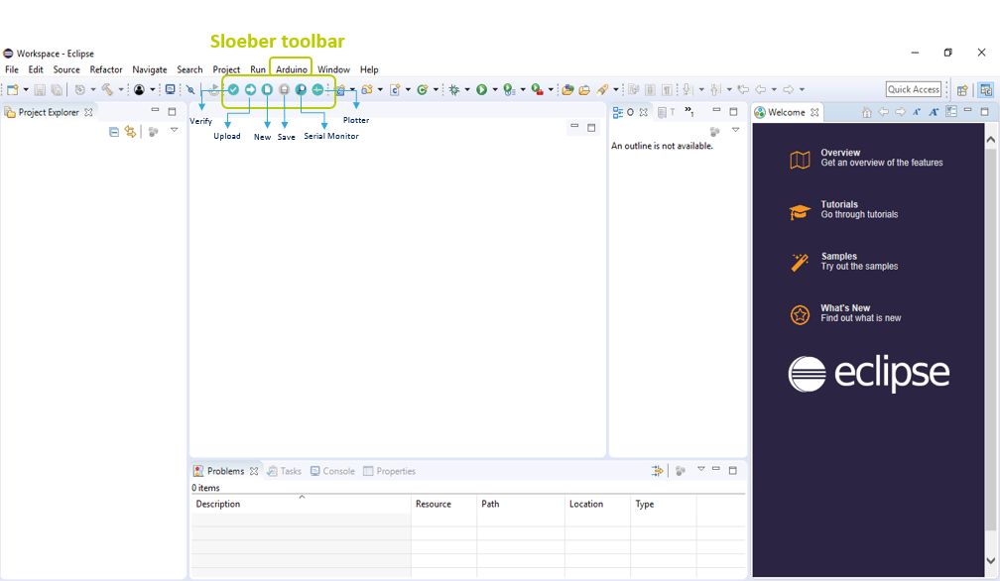
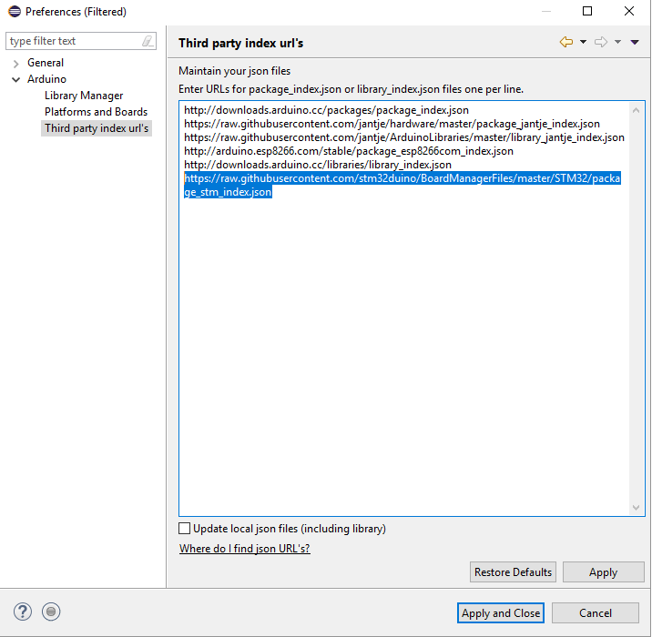
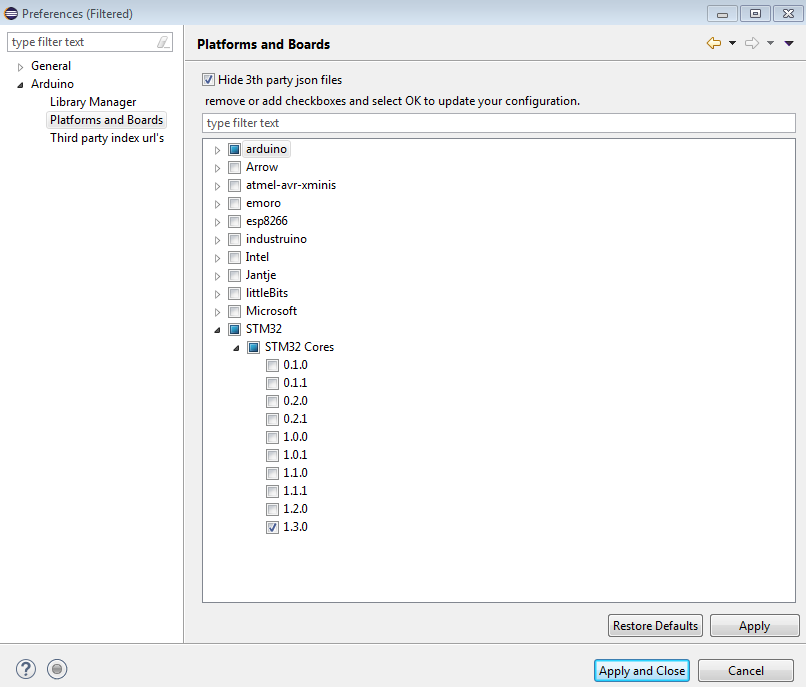
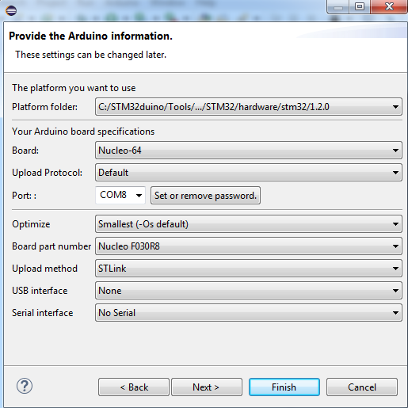
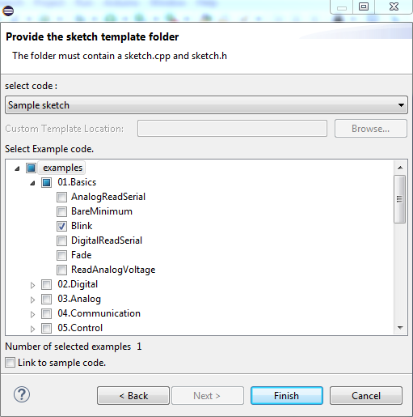
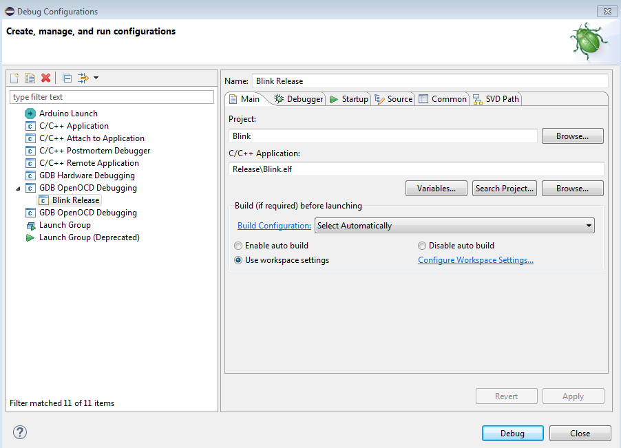
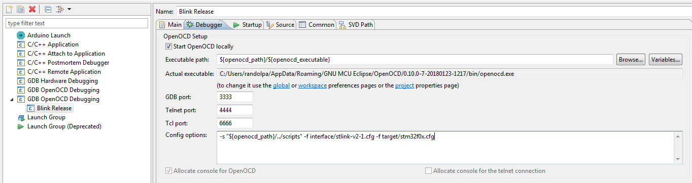
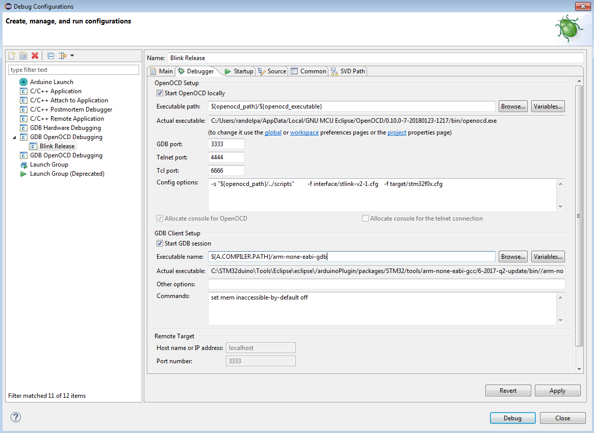
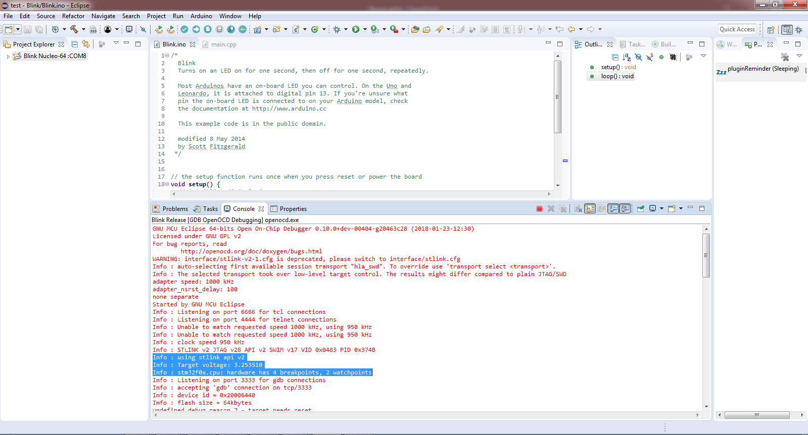
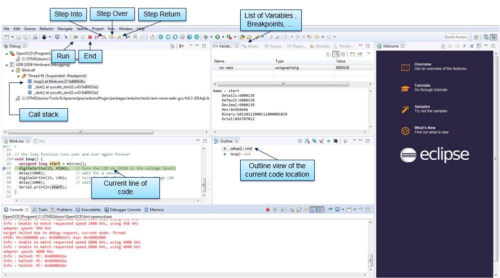

# Eclipse and Sloeber

## 1 - Software requirements

### 1.1 - Install Eclipse C/C++ IDE

Install the current [Eclipse IDE for C/C++ Developers](https://www.eclipse.org/downloads/packages/) from the Eclipse website. It includes the C/C++ Development Tooling (CDT) required by Sloeber, so an old Eclipse release repository or a separate legacy plug-in is not needed.

Install OpenOCD separately using your operating system's package manager or the [OpenOCD project documentation](https://openocd.org/). Make a note of the path to the `openocd` executable and its `scripts` directory; these paths are used later in the debug configuration.

### 1.2 - Install Sloeber (The Arduino Eclipse Plugin)

From the Eclipse main tab, go to _**“Help > Eclipse Marketplace”**_ and search for _**Sloeber**_.<br>
Download the _**"Sloeber plugin"**_, follow the recommended instructions and restart Eclipse.<br>
By now, the main tab should look like the following:


### 1.3 - Install STM32 Cores

Open _**“Arduino > Preferences”**_.<br>
In the tree view that pops up, go to _**“Arduino > Third party index url’s”**_ and add the STM32 support package URL:

https://raw.githubusercontent.com/stm32duino/BoardManagerFiles/main/package_stmicroelectronics_index.json



Hit _**“Apply and Close”**_ then re-open the _**“Arduino > Preferences”**_ menu. The STM32 Core is now available in the _**“Platforms and Boards”**_ menu.



Select the latest core version and hit _**“Apply and Close”**_.

## 2 - Programming the boards

> [!TIP]
> Make sure your board is correctly connected before going any further.

There are multiple options to start a new project.

- **Option A:** From the _**“Arduino”**_ menu, click on _**“New Sketch”**_.<br>
- **Option B:** Click on the new sketch icon directly from the toolbar.<br>
- **Option C:** From the _**“File > New > Project…”**_, click on _**“Arduino New Sketch”**_.

Regardless of the chosen method, set your _**“Project name”**_ and the _**“Location”**_ of your project. Then push the _**“Next”**_ button.
Complete the Arduino required information (board type, port number, and so on) and click _**“Next”**_.

Do not forget to select the _**“Platform folder”**_ corresponding to the STM32 Core version previously installed.



> [!NOTE]
> If you plan to debug, select _**“Debug (-g)”**_ from the _**“Optimize”**_ list, otherwise you will not have debugging symbols.

From there, you can create your own sketch or use pre-configured examples.<br>
In this case, we will try the _**“Blink”**_ example.<br>
From the _**“select code”**_ bar, apply _**“Sample sketch”**_ and then choose _**“Examples > 01.Basics > Blink”**_ and _**“Finish”**_.



> [!NOTE]
> As the GCC ARM Toolchain is provided by the STM32 core, you do not have to download it in order to program your board.

Use the _**“Arduino”**_ menu or the upload button on the toolbar to upload your sketch. If the setup is correct, the LED should blink on your board.

## 3 - Debugging Arduino Code

First, make sure your board can work with ST-LINK. The debugger support is currently fully tested with the boards supported by the STM32 core. See the [Supported boards](../../supported-boards/index.md) list.

### 3.1 Software requirements

Two standard tools are required in order to debug the code:

- **GDB, the GNU Debugger**. The STM32 core provides an `arm-none-eabi-gdb` executable in its toolchain package. Use the executable from the installed toolchain, for example `<STM32 core package>/tools/xpack-arm-none-eabi-gcc/<version>/bin/arm-none-eabi-gdb` on Linux or the corresponding `.exe` path on Windows.
- **OpenOCD**, installed separately as described in the requirements above.

> [!IMPORTANT]
> Make sure these tools are correctly installed on your platform before proceeding any further.

> [!IMPORTANT]
> Do not forget to select _**“Debug (-g)”**_ in the _**“Optimize”**_ list in the _**“Arduino Board Selection”**_ of your project, otherwise you will not have debugging symbols.

### 3.2 Setting up debug configuration

If you are using Sloeber directly, rather than CDT with the plugin, you may not find the _**“Debug Configurations”**_ menu under _**“Run”**_. This is because you are in the Arduino view, where unnecessary menus are hidden. You can switch to the regular C/C++ view or right-click your project in the Arduino view to reach the debug configurations menu.

From the _**“Run”**_ menu, select _**“Debug Configurations”**_.
Double-click on **_“GDB OpenOCD Debugging”_** to create a new configuration and set the configuration name.



Move to the _**“Debugger”**_ tab in order to configure OpenOCD and GDB.

### 3.2.1 Setting up OpenOCD

1. First, set the path to the OpenOCD executable installed on your system. Configure the path to the matching `scripts` directory as well. The executable path can be represented by an Eclipse variable, for example:

   ```text
   ${openocd_path}/${openocd_executable}
   ```

   The _**“Actual executable”**_ field shows the full executable path.

2. Set the _**“GDB port”**_ to `3333`, the _**“Telnet port”**_ to `4444`, and the _**“Tcl port”**_ to `6666`.

3. Finally, set the debugger configuration in the _**“Config options”**_ field; specify the script path folder and configuration files (`.cfg`) related to your MCU. In this case, we use a Nucleo F030R8, so the configuration arguments are:

   ```text
   -s "${openocd_path}/../scripts" -f interface/stlink-v2-1.cfg -f target/stm32f0x.cfg
   ```



> [!IMPORTANT]
> Replace the interface and target configuration files with the versions for the board you are using.

### 3.2.2 Setting up GDB

In the _**“Debugger”**_ tab, scroll to the GDB Client setup field.

- Set the _**“Executable name”**_ field to the path of the `arm-none-eabi-gdb` executable by adding `${A.COMPILER.PATH}/arm-none-eabi-gdb`.

By now, the _**“Debugger”**_ tab should look like the following:



Move to the _**“Startup”**_ tab, scroll until the _**“Run/Restart Commands”**_ fields and add:

```text
monitor reset halt
monitor reset init
```

Then go to the _**“Common”**_ tab and check _**“Debug”**_ and _**“Run”**_ in the _**“Display in favorites menu”**_.
Finally, click on _**“Apply”**_ and _**“Close”**_.

### 3.3 Launching a debug session

Launch the debug session from the _**“Debug”**_ or _**“Run”**_ button in the toolbar.<br>
If the configuration process runs correctly, you will be able to see the debug capabilities of the chip in the Debug console (number of breakpoints, watchpoints, and so on).

If you are facing problems with messages like `binary not found`, click on the drop-down menu and then on your configuration instead of clicking directly on the debug icon.



Now, you can debug your code using the Eclipse debug features, including step-by-step execution, breakpoints, memory inspection, and variable views.


