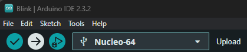

# Blink example on [Nucleo L476RG](https://www.st.com/en/evaluation-tools/nucleo-l476rg.html)

This example uses the built-in Arduino Blink sketch. No additional library is required.

## Prerequisites

- A [Nucleo L476RG](https://www.st.com/en/evaluation-tools/nucleo-l476rg.html) board
- Arduino IDE 2 with the STM32 core installed
- A USB data cable connected to the board's ST-LINK USB connector

If the core is not installed yet, follow the [Getting Started](../Getting-Started.md#install-arduinocc-ide) guide first.

## Select the board

1. Connect the board to the computer.
2. In **Tools > Board**, select **STM32 boards** and then **Nucleo-64**.
3. In **Tools > Board part number**, select **Nucleo L476RG**.
4. In **Tools > Port**, select the port provided by the board.

See [Getting Started](../Getting-Started.md#configuring-ide) for screenshots and more details.

## Open and upload the example

1. Open **File > Examples > 01.Basics > Blink**.
2. Click **Verify** to compile the sketch.
3. Click **Upload** to program the board.

If the default upload method does not work for your board, see [Upload methods](../Upload-methods.md).

## Expected result

After a successful upload, the user LED on the Nucleo L476RG should blink once per second. The sketch uses `LED_BUILTIN`, so the LED pin is selected by the board variant.

## Troubleshooting

- If the upload fails, check the selected board, port, USB data cable, and [upload method](../Upload-methods.md).
- If no port appears, reconnect the board and check that the USB cable is connected to the ST-LINK connector.
- If the upload succeeds but the LED does not blink, press the board's reset button and verify that the correct board part number was selected.
