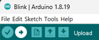

## Blink example on [Nucleo L476RG](http://www.st.com/en/evaluation-tools/nucleo-l476rg.html)

1. If not already done, [Getting Started](../Getting-Started.md#install-arduinocc-ide)

2. Configure the IDE to the desired board. 

  See [Getting Started](../Getting-Started.md#configuring-ide)

3. Open the Blink sketch from the "**File> Examples > 01.Basics > Blink**"

4. Click the upload button
  
  See [Getting Started](../Getting-Started.md#upload-methods) to change the upload method.

  

  

That's all. LED should blink on the [Nucleo L476RG](http://www.st.com/en/evaluation-tools/nucleo-l476rg.html).