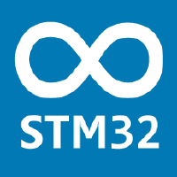

# STM32duino documentation

Documentation for the STM32 Arduino core and its libraries.

# [Getting Started](Getting-Started.md)
For full instructions on using the STM32 boards with Arduino, see the [Getting Started](Getting-Started.md) page.

# Boards available:
See [Supported boards](https://github.com/stm32duino/Arduino_Core_STM32#supported-boards) section of the [Arduino_Core_STM32/README.md](https://github.com/stm32duino/Arduino_Core_STM32#readme).

# API References:
See [API](API.md) references for usage of accessing the hardware with the Arduino API-functions.

# Libraries:
See [Libraries](Libraries.md)

# Advanced usages:
## Contributing
* [Add a new variant (board)](development/Add-a-new-variant-%28board%29.md)
* [Using git repository](development/Using-git-repository.md)
## Customization
* [Custom-definitions](customization/Custom-definitions.md)
* [Customize-build-options-using-build_opt.h](customization/Customize-build-options-using-build_opt.h.md)
* [HAL-configuration](customization/HAL-configuration.md)
* [Custom-board-based-on-a-core](customization/Custom-board-based-on-a-core.md)
## [How to debug](development/How-to-debug.md)

# Connectivities
* [STM32duinoBLE](STM32duinoBLE.md)
* [LoRa](LoRa.md)

# Troubleshooting

Check the [FAQ](FAQ.md) in case it is a common problem and it may be discussed there.

If you have any issue to download/use a package, you could [file an issue on BoardManagerFiles](https://github.com/stm32duino/BoardManagerFiles/issues/new) GitHub.

For STM32 Core or tools issue, file an issue on the related Github:
 * [Arduino_Core_STM32](https://github.com/stm32duino/Arduino_Core_STM32/issues/new).
 * [Arduino_Tools](https://github.com/stm32duino/Arduino_Tools/issues/new).

For STM32dunio libraries, file an issue on the related Github.

Or submit a topic on the [stm32duino forum](http://stm32duino.com):

 * questions on the [STM32 Core](http://stm32duino.com/viewforum.php?f=48)

 * bugs/enhancements on the [STM core: Bugs and enhancements](http://stm32duino.com/viewforum.php?f=49)

# Links
[Arduino.cc official website](https://www.arduino.cc/)

[STM32 MCU](http://www.st.com/en/microcontrollers/stm32-32-bit-arm-cortex-mcus.html)
